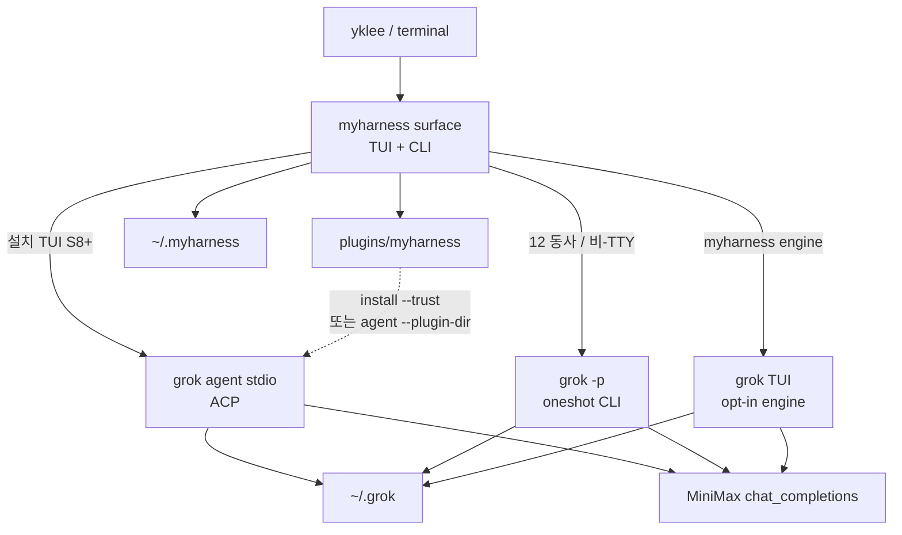
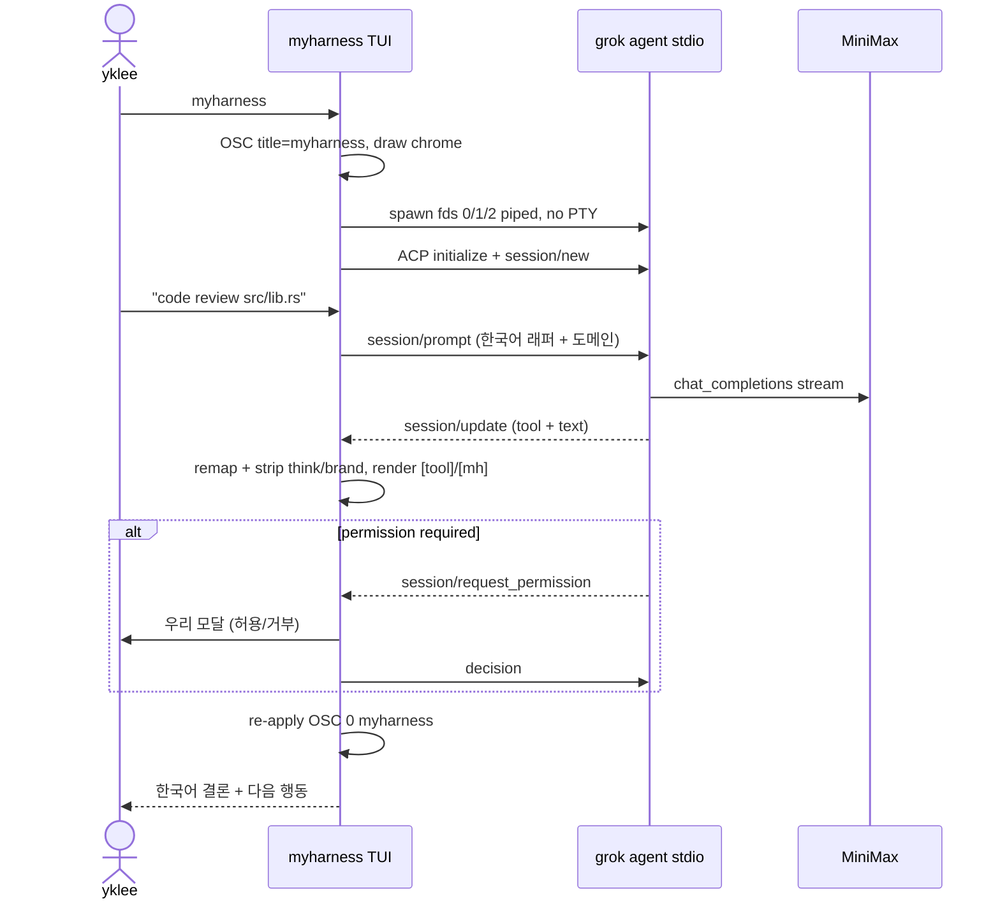

# myharness 제품 재설계 — Owned Surface + Headless Engine

| 항목 | 값 |
| --- | --- |
| 문서 제목 | myharness Product Redesign: Owned Surface + Headless Engine |
| Author | (draft, design-worker) |
| Date | 2026-08-14 |
| Status | Draft (rev 3 — re-review Issues 1–3) |
| 대상 | yklee, 이 repo 구현자 |
| 관련 결정 | D-135 (엔진=grok overlay) 유지. D-135.8 은 **사실 그대로** (grok TUI 에만 적용, `myharness engine`). 폐기하는 것은 overlay §2.1 / §13.2 와 CONCEPT §5.10 의 **기본=grok TUI** 문장뿐. 본 문서가 표면 SSOT 후보. |
| 구현 시 갱신 대상 | `docs/CONCEPT.md` §0 다이어그램 · §4.2 · §5.1 · §5.9.4 · §5.10, `docs/architecture/DETAILED_DESIGN_OVERLAY.md` §2.1 · §3.1–§3.2 · §13, `OVERLAY_IMPLEMENTATION_PLAN.md`, `plugins/myharness/README.md`, README / MiniMax.md / AGENTS.md |

---

## Overview

yklee 가 live install 후 한 말 — **"myharness는 그냥 grok인데 뭐야 뭘 설치한거야"** — 은 오해가 아니라 현재 제품의 정확한 진단이다. D-135 overlay 는 엔진 선택을 맞췄다. 그러나 표면을 grok TUI 에 맡기거나 (`bin/myharness` 초기), 그 다음엔 bash `myharness>` REPL 로 가렸다 (D-139). 둘 다 **완성된 개인 하네스가 아니다.** grok 로고/윈도 타이틀/"Grok" 카피는 **pager overlay 로 지울 수 없다** (`docs/references/grok-build.md` §4.4, §13). bash 프롬프트는 grok 를 셸 아웃하는 미완성 스크립트다. stdout 한 줄 `strip_engine_chrome` 도 같은 부류다 — stderr·OSC·툴 네임스페이스는 그대로 샌다.

본 문서는 **한 가지 제품 형태**를 고른다.

> **myharness 가 화면을 소유한다.** 설치 기본 표면(PR-S8 이후)은 우리가 그리는 작은 TUI + 구조화 CLI 다. 브랜드는 항상 `myharness` 다. 설치된 `grok` ≥ 1.0.3 는 **headless 엔진**으로만 산다: 한 턴 CLI 는 `grok -p --output-format plain`, 설치 TUI 대화는 `grok agent stdio` (ACP) + 우리 permission 모달. 벤더 TUI 는 `myharness engine` opt-in 뿐이다. **`-p` 를 백엔드로 쓰는 TUI 는 PATH 기본이 아니다.**

엔진을 버리는 설계(v0 부활, goose 포크)는 기본이 아니다. grok 를 **화면에 올리는 것**이 제품을 반쯤 만들게 한 것이지, grok 를 **추론/툴 런타임으로 쓰는 것**이 불가능해서가 아니다. grok-build 실측이 이미 정공법을 적어 두었다: *「ACP 로 TUI / 래퍼 / IDE 분리 — `myharness` → `grok agent stdio`」* (`docs/references/grok-build.md` §13.1). D-135 overlay 가 그 문장을 읽고도 `exec grok` 를 기본으로 둔 것이 실패다.

---

## Background & Motivation

### 현재 상태 (2026-08-14, M1–M3 + D-139)

| 층 | 경로 | 상태 |
| --- | --- | --- |
| 엔진 선택 | D-135 | 확정. `grok` ≥ 1.0.3. 포크 금지. 5 components 재구현 금지 |
| 래퍼 | `bin/myharness` (bash) | 12 동사 → `grok -p` (`--plugin-dir` 없음, `--always-approve` 있음), task/handoff, setup-model, 버전 가드 |
| plugin | `plugins/myharness/` | 실측: skill 3 + agent 3 + command 3 + hooks. validate PASS. overlay 문서의 7-skill / `code-implementer` 목록은 **스테이레** — `surface/` 문서에 복사하지 말 것 |
| 설치 | `scripts/install.sh` | `~/.local/bin/myharness` + `~/.myharness/plugins/myharness` |
| MiniMax | `[model.minimax]` + `MINIMAX_API_KEY` | live `env diagnose` PASS (backlog 2026-08-14 §12) |
| 기본 화면 | D-139 | bash `myharness>` REPL. `myharness engine` 만 grok TUI. **설치 기본은 PR-S8 전까지 이것** |
| v0 런타임 | `myharness/crates/{cli,tui,llm,tools,auth,context,compression,core}` | ~23k LOC 참고. D-135.6 신규 기능 금지. ratatui TUI 존재 (`myharness-llm`/`tools`/`core` 의존) |

### 통증 (사용자 문장, 창작 없음)

1. **「화면에 GROK 구성이 표시되면 좀 그렇잖아」** — grok **pager** 는 제품 표면이 될 수 없다. 로고·윈도 타이틀·테마명 `GrokNight`·빌트인 slash 64개는 overlay 로 불변 (`grok-build.md` §4.3–§4.5). 이 사실은 D-135.8 이고 **폐기하지 않는다** — `myharness engine` 에 그대로 적용된다.
2. **「myharness는 그냥 grok인데」** — 인자 없는 `myharness` 가 `exec grok` 이면 설치물이 벤더 바이너리의 별칭이다. 맞는 관찰.
3. D-139 REPL 이후에도 **반쯤 된 느낌** — 사용자 반응. 본 문서는 REPL 을 제품으로 변호하지 않는다. stdout 만 `strip_engine_chrome` 하는 것은 스킨이지 표면이 아니다. 같은 실수(stdin 만 pipe, stderr 상속)를 ACP spawn 에서 반복하면 안 된다.

### 설계 문서가 스스로 만든 함정

`docs/architecture/DETAILED_DESIGN_OVERLAY.md` §2.1:

> 기본 TUI 는 grok pager 가 in-process `MvpAgent` 를 띄운다. **우리는 ACP 클라이언트를 다시 짜지 않는다.** 래퍼는 `exec` 가 기본이다.

같은 문서 §13 성공 기준 2: `myharness` (인자 없음) → grok TUI.

CONCEPT.md §5.10:

> `orchestrator` (default) → `grok` TUI.

CONCEPT.md §4.2 Out-of-scope 는 「자체 5 components 재구현 **(TUI/**tools/session/…)」과 「grok ACP 가 있으면 엔진 측. **우리가 안 짬**」을 묶어 둔다. 본 설계는 **엔진 TUI / Tools / Session / Plugin loader 를 다시 짜지 않는다.** 그러나 **우리 픽셀의 표면 TUI** 와 **`grok agent stdio` ACP 클라이언트** 는 짠다. PR-S0 가 §4.2 를 그 경계로 다시 써야 한다. 안 그러면 S1 이 정책 위반으로 읽힌다.

D-135.1–D-135.7·D-135.9 (엔진·3-도메인·plugin·MiniMax·홈 분리·v0 freeze·Mavis 분리) 는 유지한다. D-135.8 은 **부분 폐기하지 않는다** — grok TUI 에 대한 사실이며 `myharness engine` 에 유효하다. 폐기하는 문장은 overlay §2.1 「ACP 안 짠다 / 래퍼는 exec 가 기본」, overlay §13.2, CONCEPT §5.10 의 기본=grok TUI, overlay §3.1 의 `grok -p … --plugin-dir` (live 래퍼는 `-p` 에 `--plugin-dir` 을 안 넘김, D-138).

### 실측 제약 (구현이 이미 밟은 것)

- `grok -p` 는 `--plugin-dir` 미지원. agent 서브커맨드 전용 (D-138 follow-up, `bin/myharness` oneshot 검증). 한 턴은 설치된 `~/.grok/plugins` + `--always-approve` 로 간다. **`--always-approve` 는 headless `-p` 가 멈취지 않게 하는 라이브 계약**이지 TUI 기본이 아니다.
- hook 은 fail-open (`grok-build.md` §13.4). 보안 경계로 믿지 말 것. `-p` 는 `--plugin-dir` 이 없으므로 hook 은 `grok plugin install --trust` 가 끝난 뒤에만 돈다.
- argv0 가 `grok` 가 아니면 clap 도움말에 래퍼 이름이 남을 수 있음 (`grok-build.md` §3.2). 우리는 grok 도움말을 기본 화면에 띄우지 않는다.
- 현 `bin/myharness` 는 stdout 만 strip 하고 **stderr 는 inherit**. `isatty(2)` 가 true. 본 설계의 spawn 은 이 버그를 닫는다.

---

## Goals & Non-Goals

### Goals

1. **화면의 주인 = myharness.** 기본 경로의 **사용자-가시 크롬**에 GROK wordmark / 로고 / 윈도 타이틀 / `Grok Build` / `GrokNight` / `xai-grok-pager` 가 보이지 않는다. 우리 에러 템플릿이 바이너리 이름 `grok` 과 공식 install URL 을 말하는 것은 허용 (Goal 1 ≠ 「문자열 `grok` 전면 금지」).
2. **설치 제품(PR-S8 이후)은 한 제품처럼 느껴질 것.** 인자 없음 + TTY = 우리 TUI (ACP + permission 모달). 12 동사 = 구조화 CLI. 둘 다 같은 브랜드·같은 도메인 모델. **S3 인트리 크롬은 이 목표가 아니다.**
3. **엔진은 숨긴다.** 추론·툴·세션 JSONL·permission 파이프라인·plugin loader 는 설치된 grok. 소스 포크 없음.
4. **불변 유지:** 3-도메인 (`code|server|env`), 한국어 보고, MiniMax-first, standard_ai_workflow 6원칙, 런타임 Mavis zero coupling, grok 소스 포크 금지.
5. **점진 구현.** S1 부터 *개발기* 에서 myharness 크롬이 보인다. 설치 PATH 가 바뀌는 것은 S8 (S5 이후) 한 곳뿐이다.

### Non-Goals

- `xai-org/grok-build` 포크 또는 1.36M LOC 소유 (D-134). `xai-acp-lib` path-dep 금지.
- 새 제품명. 브랜드는 `myharness` 만.
- v0 `myharness/` crates 에 신규 기능 (D-135.6 유지). `myharness-tui` 를 surface 의존으로 쓰지 않음.
- 자체 Tools / Session JSONL / Plugin loader / Sub-agent SDK / Layer 2 headroom 재구현.
- grok **pager** 의 로고·키맵·64 slash 를 overlay 로 지우기 (불가능. `engine` 외에는 그 화면을 안 연다).
- goose 를 기본 런타임으로 교체.
- 5 surface 동시 유지, Computer Use, marketplace, multi-user.
- rustc 없는 머신에 사전 빌드 바이너리 (1차). cargo-dist 는 후속.
- `-p` 백엔드 TUI 를 설치 기본으로 올리는 것 (YOLO 또는 세션 없는 대화로 보임).

---

## Key Decisions

각 결정 = 구현 계약. 이유와 폐기 조항을 같이 적는다.

| ID | 결정 | 근거 |
| --- | --- | --- |
| **K1** | **제품 형태 = A. Owned Surface + Headless Engine.** 설치 기본 화면(S8+)은 우리 TUI. grok 는 `grok -p` (한 턴 CLI) / `grok agent stdio` (설치 TUI) 만. | 사용자 불만의 핵은 브랜드·소유권이지 엔진 성능이 아니다. grok-build §13.1. B/C 는 수 주~수 개월의 런타임 재소유. D 는 사용자가 거부. A' (bash REPL 다듬기) 도 거부. |
| **K2** | **화면 소유자 = 신규 `surface/` Rust 패키지** (`myharness/` workspace 멤버 아님, 자체 `Cargo.lock`). bash `bin/myharness` 는 S8 전까지 **설치 기본**. | D-139 REPL 은 제품이 아님. v0 `myharness-tui` 는 llm/tools/core 에 묶임. D-135.6 freeze 경계. **재오픈 금지.** |
| **K3** | **브랜드는 `myharness` 만.** OSC 타이틀 `myharness`. 헤더 워드마크 `myharness`. 헤더 모델 칩은 **사용자 alias** (`MiniMax-M3` / `minimax`) — 엔진 카탈로그 id `grok-4.5` 를 칩에 그리지 않음. | grok-build §4.4. 스킨이 아니라 우리 픽셀. |
| **K4** | **grok 허용 범위:** `--version` 가드, `plugin install/validate`, `setup-model` → `~/.grok/config.toml`, `grok -p --output-format plain`, `grok agent stdio --plugin-dir`. **금지(기본 경로):** 인자 없는 `grok`, `grok login` UI, dashboard, pager TUI. D-135.8 은 **범위 한정**: grok TUI 에만 적용 (`myharness engine`). 기본 표면 제약이 아님. | D-135.1 유지. D-135.8 을 「부분 폐기」라고 부르지 말 것 — PR-S0 문서 충돌을 만든다. |
| **K5** | **제품 TUI 의 대화형 엔진 = ACP.** `grok agent stdio -m <model> --plugin-dir $PLUGIN`. 한 턴 CLI = `grok -p`. `-p` TUI 는 `SURFACE=ephemeral` / `DEBUG_EPHEMERAL=1` 디버그만 (K7). `SURFACE=tui` 는 S4b 이후 ACP. 프로토콜은 아래 **ACP 1차 프로파일**. S4a 가 S4b 전제. | `-p` 는 세션·permission UI 가 없다. `tui` 를 영원히 `-p` 로 두면 S4b/S5 를 연습할 수 없다. |
| **K6** | **12 동사 + task/handoff 는 표면이 소유.** 번역 프롬프트·한국어 지시·deploy 확인은 `surface/` 가 한다. plugin agents/skills/hooks 는 엔진에 남긴다. 라이브 트리 = skill 3 / agent 3 / command 3. | CONCEPT §5.2·§5.9. 엔진에 3-도메인 서브커맨드 없음 (`grok-build.md` §3.3). |
| **K7** | **permission 표시는 우리 UI.** 정책 엔진은 grok. hook fail-open 을 경계로 믿지 않음. **`--always-approve` 는 한 턴 CLI (`grok -p`) 에만.** S3 TUI 는 `--always-approve` 를 쓰지 않는다. 엔진이 `-p` 이면 그 TUI 는 PATH 기본 바이너리가 아니다. 설치 기본 TUI 는 S4b+S5 (ACP 모달) 이후 S8 한 번만 올라간다. | grok-build §6.3, §13.4. YOLO 크롬은 오늘의 REPL 보다 위험하다. |
| **K8** | **v0 crates = 참고만.** 새 TUI 는 v0 `app.rs` 와 *비슷하게 보이는* 4-pane 을 **새로 짠다.** 레이아웃+키맵 포트가 아니다 (v0 는 `[bot]`, slash 없음, PgUp/PgDn 없음, Esc 무시). `orchestrator.rs` / `LoopRunner` / `SubAgent` 를 복사하지 않음. `myharness-tui` path-dep 금지. | D-135.6. **재오픈 금지.** |
| **K9** | **홈 분리 유지.** `~/.myharness/` = 표면. `~/.grok/` = 엔진. `GROK_HOME` 을 합치지 않음. | D-135.5, grok-build §14.5. |
| **K10** | **REPL 은 제품이 아니다.** 설치 기본(S8+) TTY = TUI. S8 전까지 설치 TTY = 현 bash (D-139). 비-TTY 인자 없음 = **usage + exit 0** (현 `bin/myharness` 와 동일). stdin 한 턴으로 바꾸지 않음. | D-139. 비-TTY 계약을 새로 만들지 않는다. |
| **K11** | **엔진 TUI 탈출구는 남긴다.** `myharness engine` 은 경고 한 줄 후 `exec grok` (이 경로만 벤더 TTY 상속). 숨은 `myharness engine acp-probe` 는 스파이크/디버그. | 고급 slash. 기본 설치 경험에서 pager 가 안 보임. |
| **K12** | **A 재평가 트리거 (관측 가능 2개만):** (1) grok 마이너 **연속 2회**가 S4a 픽스처 핸드셰이크를 깨고 `min_version` 상향으로도 복구되지 않음. (2) Issue 1 spawn/remap 계약을 적용한 뒤에도 부모 터미널 캡처에서 `Grok Build` / OSC 덮어쓰기 / `xai-grok-pager` 가 샌다. MiniMax `chat_completions` 회귀는 K12 가 아님 — `myharness env diagnose` 가 이미 커버 (live PASS). | 「브랜드를  pantograph」는 관측이 아님. 엔진 한 번의 일시 장애로 B/C 를 열지 않음. |
| **K13** | **1차 설치 = rustc 1.91+ 필수.** bash shim 없음. rustc 없으면 `install.sh` 가 우리 메시지로 실패 (exit 2). | Open Question 5 를 닫음. 개발기 전제. |

---

## Proposed Design

### 1. 한 줄 제품 정의

**myharness = yklee 의 3-도메인 개인 하네스.** 화면은 우리 것. 머리(추론·툴·세션)는 설치된 grok. 입은 MiniMax.

### 2. 사용자가 보는 것

**설치 기본 TUI (PR-S8 이후, ACP + 모달).** TTY + 인자 없음:

```
┌──────────────────────────────────────────────────────────┐
│  myharness                           code · MiniMax-M3   │
├──────────────────────────────────────────────────────────┤
│  [sys]  3-도메인 하네스. /code /server /env /task /help     │
│  [you]  env diagnose                                      │
│  [tool] bash  uname -sm                                   │
│  [mh]   환경: macOS arm64. 엔진 1.0.3 PATH 중복 1.         │
│         다음: MiniMax 키 유지, 도메인 동사로 작업.           │
├──────────────────────────────────────────────────────────┤
│  code › _                                                 │
├──────────────────────────────────────────────────────────┤
│  task:none   perm:default   session:acp   engine:ready    │
└──────────────────────────────────────────────────────────┘
```

규칙:

- 헤더 왼쪽은 항상 `myharness` (cyan, bold). 자리만 v0 `draw` 의 title 슬롯과 같다. (`App::new("x", "orchestrator")` 는 `tui/src/lib.rs` 유닛테스트 헬퍼이지 제품 타이틀이 아니다.)
- 헤더 오른쪽은 **도메인 칩** + **사용자 alias** (`MiniMax-M3` / `minimax`). `grok` / `Grok Build` / `GrokNight` / `grok-4.5` 금지.
- 메시지 prefix: `[you]` / `[mh]` / `[tool]` / `[err]` / `[sys]`. `[bot]` · `[grok]` 없음.
- 툴 줄은 **리맵 후 짧은 이름**만 (`GrokBuild:bash` / `GrokBuildConcise:read_file` → `bash` / `read_file`). 아래 remap 표.
- 입력 프롬프트는 `code ›`. bash `myharness>` 가 아님.
- status: `engine:ready|error|degraded`, `session:acp` (제품 TUI, S4b+) 또는 `session:ephemeral` (디버그 `-p` 만). 벤더 이름 없음.
- OSC 0 = `myharness`. child 종료·strip 이후 **다시** 찍는다.

**제품 TUI vs 디버그 ephemeral (S3+ 가 영원히 `-p` 가 아님):** `MYHARNESS_SURFACE=tui` 와 unset/`ui=auto` 는 **S4b 이후 ACP** 다. `-p` 크롬은 `MYHARNESS_SURFACE=ephemeral` 또는 `MYHARNESS_DEBUG_EPHEMERAL=1` 만. 그 경로만 `session:ephemeral` + `--permission-mode plan` + `--always-approve` 없음 + 턴 타임아웃 60s. 표는 §9.

비-TTY / 파이프, 인자 없음:

```text
$ myharness
myharness — 3-도메인 하네스
Usage:
  …
```

현 `bin/myharness` 와 같이 **usage + exit 0**. stdin 을 한 턴으로 읽지 않음.

비-TTY + 동사:

```text
$ myharness env diagnose
환경: macOS arm64 …
다음: …
```

한 턴, 한국어, `<think>` 없음. 배너·REPL 없음.

### 3. 프로세스 토폴로지

```
yklee
  └─ myharness                 ← surface/ 바이너리 (S8+). 그 전엔 bin/myharness bash
        ├─ TTY / 인자 없음 (S8+)
        │     ratatui 루프
        │        └─ grok agent stdio -m minimax --plugin-dir $PLUGIN
        │              fds 0/1/2 = pipe, PTY 없음, 터미널 미상속
        │              ACP JSON-RPC on child's stdout/stdin
        │              stderr 는 부모 스레드가 drain + strip
        ├─ TTY / 인자 없음 (S8 전 설치)
        │     현 bash REPL (D-139). 제품 크롬 아님
        ├─ code|server|env <verb>
        │     grok -p --output-format plain -m minimax --always-approve
        │     (--plugin-dir 없음. plugin = install --trust)
        ├─ task start|end
        │     ~/.myharness/handoff/ 만. grok 호출 없음
        ├─ setup-model
        │     ~/.grok/config.toml 에 [model.minimax] append
        ├─ engine              ← opt-in pager. TTY 상속
        └─ engine acp-probe    ← 숨은 스파이크. 핸드셰이크 덤프
```





### 4. 화면이 하는 일 / 엔진이 하는 일

| 책임 | 소유 | 비고 |
| --- | --- | --- |
| 픽셀, 키, 워드마크, 도메인 칩 | **surface** | 새 ratatui. grok pager 0줄 |
| 12 동사 파싱·번역 | **surface** | 현 `prompt_for` 이전 |
| task/handoff/log.jsonl, 6원칙 문장 | **surface** | CONCEPT §5.9 |
| deploy 확인, `--yes` | **surface** | 현 `confirm_deploy`. TUI 자유 텍스트도 동일 가드 |
| 브랜드 스트립 + 툴 리맵 + stderr drain | **surface** | 최후 방어. 주 전략은 pager 를 안 여는 것 + fd 격리 |
| Tools, compaction, session JSONL | **grok** | 재구현 금지 |
| plugin.json 4계층, PreToolUse | **grok + 우리 트리** | 라이브 `plugins/myharness/` (3+3+3) |
| permission 정책 평가 | **grok** | 우리는 프롬프트 UI 만 |
| LLM HTTP | **grok sampler** | `[model.minimax]` |
| 서브에이전트 depth 1 | **grok** | 우리 이름 `code-reviewer` 등. 빌트인 `explore`/`plan`/`general-purpose` 섀도잉 금지 |

### 5. 소유 TUI — 새로 짜는 최소 위젯

v0 `myharness/crates/tui/src/app.rs` 는 header / messages / input / status 의 *스케치*다. `apply_key` 는 `Esc`/`Up`/`Down` 을 무시하고 slash·모달·PgUp/PgDn 이 없다. prefix 는 `[bot]`. **그걸 이식하지 않는다.** 새 `surface/src/tui/` 가 같은 네 칸을 다시 그린다. `Orchestrator` / `SubAgent` / `rig-core` / `LoopRunner` 는 가져오지 않는다.

| 위젯 | 동작 |
| --- | --- |
| Header | `myharness` + domain + 사용자 alias |
| Transcript | 스크롤. 툴은 한 줄 접힘 `[tool] bash …` (리맵 후) |
| Input | 한 줄. `/` 로 우리 slash. Enter 전송 |
| Status | task, perm, `session:acp\|ephemeral`, engine 헬스 |
| Permission modal | ACP 요청 시 overlay. y/n/always-this-session |
| Help overlay | `/help` — 우리 명령만 |

우리 slash (엔진 64 slash 와 섞지 않음):

```
/code /server /env     도메인 전환
/task start|end        로컬 workflow
/model                 표면 기본 모델 alias (엔진 -m)
/perm                  default | acceptEdits | plan
                       (Auto / DontAsk / BypassPermissions 는 고의 생략. 필요하면 myharness engine)
/engine                경고 후 벤더 TUI 로 교체 (세션 종료)
/help /quit
```

키: `Enter` 전송, `Ctrl+C` 종료(아래 시그널 계약), `PgUp/PgDn` 스크롤, `Esc` 모달 닫기. grok 키맵을 흉내 내지 않는다.

### 6. 엔진 어댑터

`surface/src/engine/` 두 백엔드, 한 트레이트.

```rust
#[async_trait]
pub trait Engine {
    async fn oneshot(&self, turn: Turn) -> Result<PlainReport, EngineError>;
    async fn connect(&self) -> Result<Box<dyn Session>, EngineError>;
}

#[async_trait]
pub trait Session {
    async fn prompt(&mut self, turn: Turn) -> Result<(), EngineError>;
    fn events(&mut self) -> Pin<Box<dyn Stream<Item = EngineEvent> + Send + '_>>;
    async fn decide(&mut self, id: PermissionId, d: PermissionDecision) -> Result<(), EngineError>;
}

pub struct Turn {
    pub domain: Domain,          // Code | Server | Env | Auto
    pub verb: Option<Verb>,
    pub text: String,
    pub wrapped: String,
    pub model: String,           // 엔진 -m, 기본 minimax
    pub permission_mode: Perm,
}
```

#### 6.1 Spawn 계약 (모든 grok child, `engine` pager 제외)

`myharness engine` (pager) 만 부모 TTY 를 inherit 한다. 그 외:

| fd | 계약 |
| --- | --- |
| 0 stdin | `Stdio::piped()` |
| 1 stdout | `Stdio::piped()` |
| 2 stderr | `Stdio::piped()` |
| PTY | 없음 (`script(1)` 로 부모만 TTY) |
| 프로세스 그룹 | `process_group(0)` (Unix). 고아 sampler 방지 |
| 터미널 | inherit 금지. `isatty(0/1/2)` 는 child 에서 false |

stderr 는 전용 스레드가 읽어 `strip_brand` 후, 비어 있지 않으면 transcript `[err]` 로만 올린다. 부모 터미널에 raw stderr / OSC 를 흘리지 않는다. child 종료·매 턴 끝에 OSC 0 `myharness` 를 다시 보낸다.

`--print-cmd` 는 argv **위에** 주석 한 줄을 찍는다:

```
# no TTY, stderr piped
grok -m minimax --always-approve --output-format plain -p '…'
```

S1/S3 인수 테스트: `script(1)` (또는 fake PTY) 아래에서 child `!isatty` on 0/1/2, 부모 캡처에 `Grok Build` / `xai-grok-pager` / OSC 타이틀 덮어쓰기 없음.

#### 6.2 브랜드 리맵 (표시 경로 전부)

| 엔진이 보내는 것 | 화면에 그리는 것 |
| --- | --- |
| `GrokBuild:*` / `GrokBuildConcise:*` / `GrokBuildHashline:*` (대소문자 무시, 네임스페이스가 `grok` 로 시작) | 콜론 앞 drop → `bash` / `read_file` / `*` |
| 에이전트 프리셋 표시 `grok-build` / `grok-build-concise` | 그리지 않음. 칩은 도메인 + 사용자 모델 alias |
| `Codex:*` / `OpenCode:*` / `MCP:*` | **유지** (GROK 크롬 아님) |
| `Grok Build`, `GrokNight`, `xai-grok-pager` | 삭제. 빈 줄이면 줄 자체 drop |
| `<think>…</think>` / ACP thought | 삭제 (6원칙) |
| 모델 카탈로그 id `grok-*` | 헤더 칩에 안 그림. 칩 = `minimax` / `MiniMax-M3` / 사용자가 `-m` 으로 준 alias |
| 우리 템플릿 `myharness: grok 이 없습니다. 설치: curl -fsSL https://x.ai/cli/install.sh \| bash` | **그대로** (허용된 운영 언급) |

규칙: 툴 id 의 leading namespace 가 case-insensitive 로 `grok` 로 시작하면 drop. 세 `ToolNamespace` (`GrokBuild`, `GrokBuildConcise`, `GrokBuildHashline`, grok-build.md §6.1) 를 명시 리스트로 구현해도 된다. `Codex` / `OpenCode` / `MCP` 는 건드리지 않는다. `tests/brand_leak.rs` 에 `GrokBuildConcise:bash` → `bash` 픽스처 한 줄을 넣는다.

`brand.rs` 는 위 표를 단일 함수로 제공한다. TUI·oneshot stdout·drain 된 stderr 가 같은 함수를 통과한다.

#### 6.3 Oneshot (`GrokPrint`) — 12 동사 / 비-TTY 만

```
grok -m "$MODEL" --output-format plain --always-approve \
    [--permission-mode X] -p "$wrapped"
```

- `--plugin-dir` 넣지 않는다 (미지원, D-138). plugin = `install.sh` 의 `grok plugin install --trust`.
- stdout 청크 → `strip_brand` → CLI 출력 또는 (디버그 ephemeral TUI 만) transcript.
- `--always-approve` 는 **12 동사 / 비-TTY CLI 에만**. K7. ephemeral TUI 는 이 플래그를 붙이지 않는다.
- ephemeral TUI 턴 타임아웃 **60s**. 초과 시 child 프로세스 그룹 종료 (`§6.5`) → `[err]` + `engine:error`. **YOLO 로 풀지 않는다.**
- `--print-cmd` 는 6.1 주석 + argv, exit 0.

#### 6.4 Interactive (`GrokAcp`) — 제품 TUI (S4b+ 인트리 기본 + S8 설치)

```
grok agent stdio -m "$MODEL" --plugin-dir "$PLUGIN" \
    [--permission-mode X]
```

- 6.1 spawn. pager 가 뜰 수 있는 TTY 를 주지 않는다.
- 핸드셰이크 실패 → TUI 는 `engine:degraded` 를 띄우고 **새 `-p` 대화를 시작하지 않는다** (세션 없는 YOLO 대화로 폴백 금지). 사용자는 한 턴 CLI 동사를 쓰거나 `/quit`. `-p` 크롬은 `SURFACE=ephemeral` / `DEBUG_EPHEMERAL=1` 만.
- thought / `<think>` drop.
- 세션 id → `~/.myharness/state/engine-session.toml`. `-c`/`-r` 은 2차.

#### 6.5 ACP 1차 프로파일 (S4b 구현 계약)

**S4a 실측 (2026-08-14, grok 1.0.3).** 바이트는 `surface/tests/fixtures/acp/`. 라이브 덤프를 그대로 커밋하지 않음 (MCP env/args 에 시크릿).

| 항목 | S4a 확정 | 이유 |
| --- | --- | --- |
| crate | crates.io `agent-client-protocol` **0.12.x** (S4b). S4a 는 `serde_json` NDJSON 만 | 핸드롤은 스파이크. `xai-acp-lib` path-dep 은 D-134. |
| 프레이밍 | **NDJSON** (한 줄 = 한 JSON-RPC). Content-Length 는 `failed to parse incoming message` | 설계 초안 LSP 는 기각. hang 폴백 `-p` 금지 (6.4). |
| argv | `grok agent -m <model> --plugin-dir <dir> stdio` | `-m`/`--plugin-dir` 는 `agent` 위. `grok agent stdio -m` 은 unexpected argument. |
| 프로토콜 버전 | `1` (initialize params + result) | grok 1.0.3 |
| client caps | `fs: false`, `terminal: false` | 엔진이 툴을 가짐. prompt + permission UI 만 |
| 무시 | thought, usage, fs diffs, `_x.ai/*` 알림, session/update 의 모르는 필드 | 전방 호환. MCP 알림은 시크릿을 실을 수 있음 → persist 금지 |

메서드 (S4a handshake 에서 확인한 것 / 아직 툴 턴에서만 나오는 것):

**initialize** (request → response) — **확인**

```json
{"jsonrpc":"2.0","id":1,"method":"initialize","params":{
  "protocolVersion": 1,
  "clientInfo": {"name":"myharness","version":"0.1.0"},
  "capabilities": {"fs": false, "terminal": false}
}}
```

결과: `protocolVersion=1`, `agentCapabilities` (loadSession, promptCapabilities, mcpCapabilities, sessionCapabilities), `authMethods` (`xai.api_key` / `cached_token` / `grok.com`).

**session/new** — **확인**. `permissionMode` 없이 성공.

```json
{"jsonrpc":"2.0","id":2,"method":"session/new","params":{
  "cwd": "<abs>",
  "mcpServers": []
}}
```

응답: `sessionId`, `models.currentModelId`. 저장.

**session/update** (notification) — **확인**. `{sessionId, update, _meta}`. 처리: assistant text → `[mh]`, tool call → remap 후 `[tool]`, thought → drop. 모르는 필드는 ignore.

**session/prompt** (request). 본문 = `Turn.wrapped`. handshake 미관측. S4b.

**session/request_permission** (request). handshake 미관측. S5 모달 → `allow` / `deny` / `allow_session`.

**authenticate** — `cached_token` 은 session/new 전제 아님 (확인). 1차 skip.

**취소 / 종료**

- TUI `Ctrl+C` 또는 `/quit`: 열려 있으면 cancel 통지(S4a 가 메서드명을 확정) → 프로세스 그룹에 `SIGTERM` → 2s 후 `SIGKILL` → OSC 0 재적용.
- `-p` child 도 같은 그룹 계약.
- 고아 HTTP sampler 를 남기지 않는 것이 목표. 타임아웃은 로그 `engine.kill`.

**Auth / env**

- child 는 부모 env 를 **상속**한다. `MINIMAX_API_KEY` 가 있어야 MiniMax 가 돈다.
- 우리가 키를 argv 에 넣거나 `log.jsonl` / `MYHARNESS_DEBUG` 덤프에 쓰지 않는다. 「env 로 키 전달 안 함」은 **추가 주입·로그 금지**이지 unset 이 아니다.
- 디버그 argv 덤프는 값 레드액션: `MINIMAX_API_KEY`, `*_API_KEY`, `Authorization`, 프롬프트 전문.

**숨은 프로브**

```
myharness engine acp-probe [--out path]
```

`--help` 에 광고하지 않음 (`hide = true`). stdin/stdout/stderr pipe 로 initialize+session/new 까지 레드액션 JSON. S4a 픽스처의 재현 수단. MCP `args`/`env`/키는 persist 금지.

#### 6.6 가드 (현 `ensure_engine` 이전)

- `MYHARNESS_GROK` 또는 `PATH` 의 `grok`.
- `grok --version` ≥ 1.0.3. 실패 시 우리 메시지 (Goal 1 허용 예외): `myharness: grok 이 없습니다. 설치: curl -fsSL https://x.ai/cli/install.sh | bash`. exit 2.
- plugin.json 없으면 exit 2.

### 7. 3-도메인 · MiniMax · workflow · permission

**12 동사** — CONCEPT §5.2 문구 유지. 구현만 surface clap. 번역은 현 `prompt_for`. TUI 자연어 → `Domain::Auto` (키워드: review/implement/commit → code, deploy/logs/status → server, diagnose/brew/install → env, 그 외 code). 확정 못 하면 칩 `auto` 로 두고 엔진+라이브 agents 에 맡긴다.

**MiniMax** — 변경 없음. 기본 `-m minimax`. `setup-model` + `examples/minimax.toml`. 키는 env. v0 Device Grant 1차 비연결.

**task / handoff** — 엔진 바깥. `~/.myharness/handoff/tasks/<id>.md`. TUI `/task` 와 CLI 가 같은 파일. `ai-workflow/memory/` auto-detect 는 2차. ephemeral TUI 는 `/task` 상태를 wrap 에 **넣지 않는다** (로컬 파일만).

**6원칙** — 한국어, think 숨김, 상태 4값, `log.jsonl`, 비참조, handoff 구조. 설치 TUI 는 ACP 세션이 기억한다. ephemeral TUI 는 기억을 약속하지 않는다.

**permission / hooks**

1. `--permission-mode` → 엔진 (overlay §7 표 중 우리가 노출하는 것: `default` / `acceptEdits` / `plan`).
2. `server deploy` **및** TUI 자유 텍스트가 deploy 패턴을 품으면 엔진 전에 우리 confirm. 비-TTY 는 `--yes`. `MYHARNESS_ALLOW_DEPLOY=1`.
3. `pre_tool_guard.sh` 유지. fail-open.
4. 진짜 차단 = `--deny` + folder-trust.
5. 제품 TUI (S4b+): ACP 모달, YOLO 아님. 한 턴 CLI: `--always-approve` (라이브). 디버그 ephemeral TUI: `--permission-mode plan` 강제 (`/perm default` 무시), `--always-approve` 없음, 턴 60s 타임아웃.

### 8. 디렉터리 — 신규 `surface/` (v0 와 분리)

```
surface/                         # 자체 패키지. myharness/ workspace 멤버 아님
  Cargo.toml                     # package name = myharness, edition 2024, rust-version = 1.91
  Cargo.lock                     # S1 부터 커밋
  rust-toolchain.toml            # 1.91 (v0 myharness/ 와 맞춤, workspace 공유 아님)
  src/
    main.rs
    brand.rs
    domain.rs
    workflow.rs
    engine/{mod,detect,print,acp}.rs
    tui/{mod,app,events,perm_modal}.rs
  tests/
    brand_leak.rs
    spawn_fds.rs                 # script(1) / fake TTY
    domain_prompt.rs
    fixtures/acp/                # S4a 가 채움
```

빌드 (워크스페이스 `-p` 아님):

```bash
cargo build --release --manifest-path surface/Cargo.toml
# artifact: surface/target/release/myharness
```

의존: `clap`, `ratatui` 0.30, `crossterm`, `tokio`, `serde_json`, `thiserror`. S4b 에서 `agent-client-protocol` 0.12. **넣지 않음:** `rig-core`, `myharness-llm`, `myharness-tui`, `rmcp`, grok 소스 path.

설치는 **PR-S8 만** `install.sh` 가 위 바이너리를 `~/.local/bin/myharness` 에 복사한다. rustc 없으면 K13.

### 9. Surface-mode matrix + process + signals

`MYHARNESS_SURFACE=tui` 는 S3 의 임시 `-p` 가 **영원히** 아니다. S4b 이후 `tui` = ACP (다운그레이드 아님).

| 선택 | S3–S4a | S4b–S7 (인트리) | S8+ 설치 |
| --- | --- | --- | --- |
| unset / `ui=auto` | 설치 PATH = bash. `cargo run` = ephemeral `-p` | `cargo run` = **ACP** | **ACP** |
| `MYHARNESS_SURFACE=tui` | ephemeral `-p` | **ACP** (`-p` 가 아님) | **ACP** (S8 과 동일) |
| `MYHARNESS_SURFACE=ephemeral` 또는 `MYHARNESS_DEBUG_EPHEMERAL=1` | `-p` + plan + 칩 + 60s | 같은 **디버그** 경로 | 디버그 전용. 제품 아님 |
| `plain` / `--plain` | CLI | CLI | CLI |
| `legacy` | 설치 = bash (D-139) | 설치 = bash | **거부** exit 2 + `S8 이후 없음. --uninstall 로 구 래퍼` |

`[surface] ui` 값: `auto | tui | plain | ephemeral`. env 는 위 표 + `legacy`. `auto` 와 `tui` 는 S4b 이후 같은 엔진(ACP).

| 상황 | 동작 |
| --- | --- |
| 비-TTY, 인자 없음 | usage, exit 0 |
| 비-TTY, 동사 | oneshot `-p` (CLI YOLO), strip 후 stdout |
| TTY, 인자 없음 | 위 매트릭스 |
| TTY, `--mode=orchestrator` **만** (동사 없음) | 위 매트릭스의 TUI 행. **grok TUI 가 아님** |
| TTY, `--mode=orchestrator` + `code\|server\|env …` | **oneshot CLI** (12 동사가 이김. TUI 를 열지 않음) |
| TTY, `--mode=single` | `-p` CLI (현 동작) |
| `--plain` | TTY 여도 TUI 금지 |
| Ctrl+C / `/quit` | §6.5 그룹 종료 + OSC 재적용 |
| `myharness engine` | pager. 시그널은 grok 소유 |

### 10. 유지 / 폐기

**유지**

| 자산 | 처분 |
| --- | --- |
| D-135.1–.7, .9 | 유지 |
| D-135.8 | **유지.** 범위 = grok TUI / `myharness engine` |
| `plugins/myharness/**` (라이브 3+3+3) | 유지 |
| `scripts/install.sh` | S8 에서 복사 대상만 Rust |
| `scripts/overlay_smoke.sh` | 유지·확장 |
| 12 동사, `prompt_for`, task 포맷, setup-model | Rust 이식 (S2). 설치 기본은 S8 까지 bash |
| 버전 가드, exit 2, `--print-cmd` | 이식 |
| `~/.myharness` / `~/.grok` | 유지 |
| v0 `myharness/` | 참고. 즉시 삭제 금지 |

**폐기 (제품 경로에서)**

| 자산 | 처분 |
| --- | --- |
| 인자 없음 → `exec grok` | 이미 D-139. overlay §13.2 잔여 삭제 |
| overlay §2.1 "ACP 안 짠다 / exec 기본" | 본 문서로 대체 |
| overlay §3.1 `grok -p … --plugin-dir` | D-138 에 맞게 삭제 (S2 구현자가 깨진 플래그를 되넣지 않게) |
| CONCEPT §5.10 orchestrator = grok TUI | orchestrator = 우리 TUI + 엔진 서브에이전트 |
| CONCEPT §4.2 「TUI/ACP 우리가 안 짬」 | 엔진 TUI 금지 / 표면 TUI·ACP 클라이언트 허용으로 재작성 |
| bash REPL 을 설치 기본으로 **영구** 유지 | S8 에서 제거 |
| v0 런타임 부활 / grok 포크 / goose 기본 | 거부 |

---

## API / Interface Changes

### CLI — 사용자 계약

| 입력 | 지금 (D-139) | S2–S4a (설치=bash) | S4b–S7 인트리 | S8+ |
| --- | --- | --- | --- | --- |
| `myharness` (TTY, unset/`tui`) | bash REPL | 설치=bash. `cargo run`/`tui` = ephemeral | `cargo run`/`tui` = **ACP** | **ACP** |
| `MYHARNESS_SURFACE=ephemeral` | 없음 | `-p` 디버그 TUI | 동일 (제품 아님) | 동일 (제품 아님) |
| `MYHARNESS_SURFACE=legacy` | (설치 기본이 bash) | 설치 bash | 설치 bash | **exit 2** |
| `myharness` (pipe) | usage, exit 0 | 동일 | 동일 | 동일 |
| `myharness code\|server\|env …` | `grok -p` + stdout strip | S2 가 Rust 로 동등. 설치는 bash | 동일 | 동일 + 우리 포맷터 |
| `myharness task …` / `setup-model` | 로컬 / `~/.grok/config.toml` | 동일 | 동일 | 동일 |
| `myharness engine` | grok TUI | 동일 + 경고 | 동일 | 동일 |
| `myharness engine acp-probe` | 없음 | S4a | 숨은 프로브 | 숨은 프로브 |
| `myharness --mode=single …` | `grok -p` | 유지 | 유지 | 유지 |
| `myharness --mode=orchestrator` (동사 없음) | (문서상 grok TUI) | 설치 no-op. 인트리는 매트릭스 TUI | **ACP TUI** | **ACP TUI** |
| `myharness --mode=orchestrator code review …` | 미정의 | **oneshot CLI** (동사가 이김) | 동일 | 동일 |
| `myharness --mode=loop --goal` | 프롬프트에 goal | 유지 (1차) | 유지 | 유지 |
| 자유 텍스트 위치 인자 | `grok -p` | 설치는 `-p` | TTY 면 TUI 초기 메시지 | 동일 |

신규 플래그:

```
--plain              TTY 여도 TUI 금지
--print-cmd          유지. 선행 주석 `# no TTY, stderr piped`
--model / --yes      유지
```

`--help` 에 "엔진 TUI" 는 opt-in 만. smoke 의 `grep '엔진 TUI'` 계약 유지.

사용자에게 ACP 를 노출하지 않는다. 통과형 `myharness agent stdio` 는 만들지 않는다. 디버그 = `MYHARNESS_DEBUG=1` (레드액션) + `engine acp-probe`.

---

## Data Model Changes

스키마 마이그레이션 없음. 파일 추가만.

### `~/.myharness/config/config.toml`

```toml
[engine]
binary = "grok"
min_version = "1.0.3"
plugin_dir = "~/.myharness/plugins/myharness"

[llm]
default_model = "minimax"     # 헤더 칩 alias. 엔진 -m 도 이것

[surface]
ui = "auto"                  # auto | tui | plain | ephemeral
                             # auto/tui: S4b+ 는 ACP. S3–S4a cargo run 만 ephemeral
                             # ephemeral: 디버그 `-p`. 제품 아님
brand_strict = true          # 런타임: 스트립 실패 span 은 그리지 않고 [err] + log.jsonl
                             # CI: brand_leak / spawn_fds 는 fail (로그로 끝내지 않음)

[workflow]
mode = "auto"

[permission]
oneshot_always_approve = true  # grok -p CLI (12 동사) 만
tui_mode = "default"           # 제품 ACP TUI. ephemeral 은 코드가 plan 으로 강제
```

없는 파일 = 위 기본값. env `MYHARNESS_MODEL` / `MYHARNESS_GROK` / `MYHARNESS_PLUGIN_DIR` / `MYHARNESS_SURFACE` / `MYHARNESS_DEBUG_EPHEMERAL` 유지.

`brand_strict` 런타임 = 로그 + 미표시. 테스트 = fail. 둘을 한 키로 섞지 말 것 — 테스트는 키와 무관하게 항상 fail.

### `~/.myharness/state/engine-session.toml`

```toml
acp_session_id = "…"
updated_at = "2026-08-14T12:00:00+09:00"
model = "minimax"
domain = "code"
```

### task 파일

현 `task_cmd` 포맷 유지 (`status` / `title` / `started_at` / `summary` / `risks` / `follow_up` / `ended_at`).

### 이벤트 로그

```json
{"ts":"2026-08-14T12:00:00+09:00","event":"engine.spawn","kind":"acp","ok":true}
```

금지: API 키, env 값, 프롬프트 전문, argv 통째.

---

## Alternatives Considered

### A. Overlay 유지 + grok 완전 은닉 — **채택**

우리 표면 + `grok -p` (CLI) / `grok agent stdio` (설치 TUI).

| | |
| --- | --- |
| 장점 | D-135 엔진 이득. 브랜드 문제의 직접 해답. grok-build §13.1. |
| 단점 | ACP 클라이언트. 프로토콜 drift. stderr/OSC/툴 id 리맵 필요. |
| 비용 | surface + S4a 스파이크 + 얇은 클라이언트. 런타임 재작성 아님. **S0–S2 는 수일. 설치 대화 TUI (S4b–S8) 는 그 다음.** 「3–4주에 S0–S8 광택 대화」는 가정하지 않는다. |
| 사용자 문장 | S8 이후 설치물이 myharness 화면이다. |

### A-inline (기각). 라인/인라인 표면

fullscreen 없이 `read_line` 또는 ratatui inline. OSC 타이틀·`[mh]`·slash 만 소유.

| | |
| --- | --- |
| 장점 | 새 코드가 적다. aider 교훈 (REFERENCES.md): fullscreen 이 소유권의 필요조건은 아님. |
| 단점 | permission 모달·툴 접기·`session:acp` 칩이 프레임을 필요로 한다. 어제 `myharness>` 를 친 사용자에게 inline 은 D-139 와 같은 「반쯤」으로 읽힌다. ACP 는 어느 쪽이든 짜야 한다. |
| 판정 | **기각.** 취향이 아니라 모달/툴 접기. A' 와 같은 실패 모드. |

### A' (기각). bash REPL 을 다듬기

D-139. 스트립·배너만으로는 제품이 안 된다.

### B. v0 ratatui + rig-core 부활 — **지금 아님**

수 개월. D-135.6 철회. K12 관측 2개 중 하나가 닫히기 전에는 재오픈하지 않음.

### C. Goose 포크 — **기본 아님**

D-134: 독립 런타임이 필요할 때만. 게이트 = K12.

### D. grok TUI 수용 — **거부**

사용자가 이미 거부.

---

## Security & Privacy Considerations

| 위협 | 심각도 | 대응 |
| --- | --- | --- |
| 벤더 TUI 가 기본으로 뜸 | High | pager spawn 금지. 0/1/2 pipe. `engine` 만 inherit |
| stderr OSC 가 타이틀을 GROK 로 덮음 | High | stderr pipe + drain + OSC 재적용. spawn_fds 테스트 |
| hook fail-open / `rm -rf /` | High | guard + `--deny` + deploy confirm. hook 만 믿지 않음 |
| 설치 TUI 가 `--always-approve` | High | K7. S8 게이트 = S5. S3 는 PATH 기본 아님 + plan mode |
| `MINIMAX_API_KEY` 가 debug/log 로 샘 | Med | 상속은 허용. argv/log/debug 레드액션. 프롬프트 전문 금지 |
| `~/.grok/auth.json` 평문 | Med | 1차 키체인화 안 함. 0600. 표면 로그에 키 금지 |
| `myharness engine` 텔레메트리 UI | Low | opt-in 경고 |
| plugin `--plugin-dir` 자동 trust | Low (의도) | 우리 트리만 |
| `/perm` 로 BypassPermissions | Low | 고의 생략. pager 만 |

Auth: 1차 = env 키. `myharness auth` 는 overlay §11 Q2 후속.

---

## Observability

| 신호 | 위치 | 용도 |
| --- | --- | --- |
| 사용자 보고 | stdout / `[mh]` | 한국어, 결론+다음 |
| 이벤트 | `log.jsonl` | spawn, oneshot/acp, perm, task, brand_strip_hit, engine.kill |
| 디버그 | `MYHARNESS_DEBUG=1` stderr | 레드액션된 argv, acp method, latency |
| `--print-cmd` | stdout | `# no TTY, stderr piped` + argv. 실행 안 함 |
| 엔진 세션 | `~/.grok/` JSONL | 엔진 소유. 1차 파싱 안 함 |
| 메트릭 / 알림 | 없음 | `engine:error` + exit code |

**브랜드 테스트 (두 층)**

1. **Goal 1 (사용자 크롬):** wordmark / 로고 / OSC 타이틀 / `Grok Build` / `GrokNight` / `xai-grok-pager` / 헤더의 `grok-*` 모델 id 없음.
2. **S7 smoke:** 위 문자열 + 부모 캡처. **예외 (허용):** `myharness engine --help` 설명, `--print-cmd` 의 basename `grok`, 우리 가드 문장 `grok 이 없습니다` + 공식 `install.sh` URL. `(?i)\bgrok\b` 전면 금지는 Goal 1 과 모순이므로 **쓰지 않는다.**

지연 목표: 첫 프레임 100ms (spawn 전 크롬), 가드 300ms, ACP initialize 2s (초과 시 degraded — `-p` 대화 폴백 없음), ephemeral `-p` 턴 **60s** (초과 시 `[err]` + `engine:error`, YOLO 금지), `env diagnose` 는 현 경로와 동등.

---

## Rollout Plan

플래그: `MYHARNESS_SURFACE=auto|tui|plain|legacy|ephemeral`. 별칭 `MYHARNESS_DEBUG_EPHEMERAL=1` → `ephemeral`.

- 설치 PATH (S8 전): 플래그 없음 = bash (`bin/myharness`). `legacy` 도 bash.
- `tui` / unset `cargo run`: S3–S4a 만 ephemeral. **S4b 이후 ACP.**
- `ephemeral`: 항상 `-p` 디버그. 제품 문서에 올리지 않음.
- S8 이후 `auto`/`tui` = ACP. `legacy` = exit 2.

PR 번호 = 롤아웃 번호. 「S5」는 항상 PR-S5 다.

| 단계 | 사용자 경험 | 롤백 |
| --- | --- | --- |
| S0 | 문서만 | revert |
| S1 | `cargo build --manifest-path surface/Cargo.toml` 크롬. 엔진 없음 | 설치 없음 |
| S2 | 인트리 12 동사 + task = bash 동등. **설치는 bash** | PATH 유지 |
| S3 | **인트리만** TUI. 이 시점의 `cargo run` / `tui` = ephemeral `-p` + plan + 60s. **install.sh 손대지 않음** | 플래그 끄기 |
| S4a | `engine acp-probe` + 픽스처. 제품 UX 변화 없음 | 픽스처 revert |
| S4b | 인트리 기본 + `SURFACE=tui` 가 **ACP** 로 전환. ephemeral 은 별도 디버그 값 | `SURFACE=ephemeral` 로만 `-p` |
| S5 | 인트리 ACP permission 모달 (`cargo run` / `tui` 로 연습 가능) + TUI deploy confirm | 동일 |
| S6 | 인트리 slash / 도메인 칩 | 동일 |
| S7 | 브랜드·fd 회귀. **`grok agent stdio` spawn_fds 필수** | 테스트 revert |
| S8 | **유일한 설치 전환.** `install.sh` → Rust. 게이트 = S5 (따라서 S4b) + S7. YOLO TUI 금지 | `--uninstall` + 구 bash |
| S9 | v0 archive, yklee 승인 | 태그 `v0-standalone` |

롤백 단위는 표면 바이너리. `~/.grok` 는 안 건드린다.

---

## Risks

| 리스크 | 심각도 | 완화 |
| --- | --- | --- |
| ACP 스키마 불안정 | High | S4a 픽스처. 최소 메서드. hang 을 `-p` 로 숨기지 않음. K12(1) |
| fd 2 inherit → 브랜드/OSC | High | 6.1 전 fd pipe. spawn_fds. OSC 재적용. K12(2) |
| `-p` TUI 가 설치 기본 (YOLO 또는 기억 없는 대화) | High | K7. S8 게이트 = S5. `tui` 는 S4b 이후 ACP. `-p` 는 `ephemeral` 디버그만 |
| `-p` 에러의 `Grok Build` / `GrokBuildConcise:` | Med | §6.2 전 `Grok*` 네임스페이스 drop |
| Plan-mode `-p` 가 pipe 위에서 프롬프트 hang | Med | ephemeral 턴 60s → `[err]` + `engine:error`. YOLO 로 풀지 않음 |
| S3 멀티턴이 「대화」로 읽힘 | Med | `tui` 를 S4b 이후 ACP 로 승격. `-p` 는 `session:ephemeral` + 예산 |
| v0 llm/tools 를 surface 에 링크 | Med | Cargo.toml 금지. 리뷰 |
| CONCEPT/overlay drift | Med | PR-S0 가 코드보다 먼저. §4.2·§3.1 `--plugin-dir` 포함 |
| rustc 없는 머신 | Low | K13. 명확한 실패 |

### ephemeral `-p` 예산 (디버그 전용)

제품 경로가 아니다 (`SURFACE=ephemeral` / `DEBUG_EPHEMERAL=1` 만. S3–S4a `cargo run` 과도기 포함).

- wrap 에 넣는 것: 최근 **N=6** `[you]`/`[mh]` 줄. 각 줄 **≤ 400자**. 합 **≤ 2_000자**.
- 넣지 않는 것: `[tool]` 본문, `[err]`, `/task` 파일, 엔진 세션 id.
- 칩 `session:ephemeral` + `[sys]` 「턴마다 새 한 방. 제품 아님」.
- `/perm` 은 `plan` 고정. `default` 를 무시.
- 턴 타임아웃 **60s** → 그룹 킬 + `[err]` + `engine:error`. `--always-approve` 로 풀지 않음.
- Domain::Auto 는 §7 키워드. 실패 시 `auto`.

---

## Open Questions

1차 구현을 막지 않는 것만 남긴다. Q5 는 K13 으로 닫음. ACP 바이트는 열린 질문이 아니라 S4a 산출물이다.

1. **`myharness auth`** — 1차 skip (env 키). v0 Device Grant 중계는 overlay §11.2.
2. **세션 resume (`-c`/`-r`)** — 1차 없음. S4b 이후.
3. **loop mode 위젯** — 1차 = 프롬프트에 goal 삽입.
4. **S4a 가 NDJSON 을 보면** — 프로파일 프레이밍 행만 개정. crate 선택은 유지 시도.

---

## References

- `docs/CONCEPT.md` §0, §4.2, §5.1–§5.2, §5.9–§5.12
- `docs/architecture/DETAILED_DESIGN_OVERLAY.md` §1 D-135.8, §2.1, §3.1–§3.2, §13
- `docs/architecture/OVERLAY_IMPLEMENTATION_PLAN.md`
- `docs/references/grok-build.md` §2.1, §3, §4.3–§4.5, §5.2, §6.1, §6.3, §13, §15
- `docs/references/goose.md` / D-131 — `agent-client-protocol` 0.12.x
- `bin/myharness`, `plugins/myharness/` (라이브 3+3+3, README 의 `--plugin-dir` 문장은 S0 에서 수정)
- `plugins/myharness/hooks/pre_tool_guard.sh`, `examples/minimax.toml`
- `scripts/install.sh`, `scripts/overlay_smoke.sh`
- `myharness/crates/tui/src/app.rs` — 스케치 참고. 포트 아님
- `myharness/crates/tui/src/orchestrator.rs` — 이식 금지
- `ai-workflow/memory/backlog/2026-08-14.md` §12–§13

---

## PR Plan

각각 단독 리뷰 가능. **설치 전환 소유자는 S8 하나.** S3 에 install 스위치를 넣지 않는다.

| PR | 제목 | 파일 / 컴포넌트 | 의존 | 설명 |
| --- | --- | --- | --- | --- |
| **PR-S0** | docs: 표면 SSOT 를 Owned Surface 로 | CONCEPT §0 다이어그램 · §4.2 · §5.1 · §5.9.4 · §5.10; overlay §2.1 · §3.1–§3.2 · §13; OVERLAY_IMPLEMENTATION_PLAN; `plugins/myharness/README.md` (`--plugin-dir` 를 agent 전용으로); README / MiniMax / AGENTS; development_log | 없음 | D-135.1–.7/.9 유지. D-135.8 은 grok TUI 사실로 **유지**. 삭제: 「ACP 안 짠다」, 기본=grok TUI, `-p --plugin-dir`. §4.2 를 「엔진 TUI/5 components 재구현 금지, 표면 TUI+ACP 클라이언트 허용」으로. 코드 0. |
| **PR-S1** | feat(surface): myharness 크롬 TUI | 신규 `surface/` (`Cargo.toml` + **Cargo.lock** + rust-toolchain 1.91 + 4-pane + `brand.rs` + snapshot + `tests/brand_leak.rs` + `tests/spawn_fds.rs` stub) | PR-S0 | 엔진 spawn 없음. `GrokBuildConcise:bash` → `bash` 픽스처. v0 crate 미링크. |
| **PR-S2** | feat(surface): 12 동사 + task + setup-model | `domain.rs` `workflow.rs` `engine/detect.rs` `engine/print.rs`, overlay_smoke 가 인트리 바이너리도 돌 수 있게 | PR-S1 | bash 동등. `--print-cmd` 에 `# no TTY, stderr piped`. **설치는 bash.** |
| **PR-S3** | feat(surface): 인트리 TUI (이 시점만 ephemeral `-p`) | `surface/src/tui/*` | PR-S2 | `cargo run` / `SURFACE=tui` 는 **S4b 전까지** `-p` + plan + 60s + `session:ephemeral`. `SURFACE=ephemeral` 플래그를 이미 받도록 심는다. **PATH 변경 없음.** |
| **PR-S4a** | test(surface): grok agent stdio 스파이크 | `myharness engine acp-probe`, `tests/fixtures/acp/*`, 본 문서 §6.5 바이트 개정 (필요 시) | PR-S2 | 제품 UX 없음. 프레이밍·5 메서드 확정. S4b 전제. |
| **PR-S4b** | feat(surface): ACP 클라이언트 | `engine/acp.rs`, `agent-client-protocol` 0.12 | PR-S3 + **PR-S4a** | **인트리 기본 + `SURFACE=tui` 를 `GrokAcp` 로 전환.** `ephemeral` / `DEBUG_EPHEMERAL=1` 만 `-p`. hang 시 `-p` 대화 폴백 없음. `--plugin-dir` 여기만. 설치 PATH 는 그대로 bash. |
| **PR-S5** | feat(surface): permission 모달 + TUI deploy 가드 | `tui/perm_modal.rs` | PR-S4b | ACP 모달 — `cargo run` / `SURFACE=tui` 가 이제 ACP 이므로 연습 가능. TUI 자유 텍스트 deploy confirm. YOLO 금지. **S8 게이트.** |
| **PR-S6** | feat(surface): 도메인 칩 + slash + /task | TUI header/input | PR-S3 (S5 와 병렬 가능) | `/code|/server|/env|/task|/perm|/help|/quit`. `/perm` = default\|acceptEdits\|plan (ephemeral 은 plan 고정). |
| **PR-S7** | test: 브랜드·fd 회귀를 smoke 에 | `scripts/overlay_smoke.sh` + `spawn_fds` vs **`grok agent stdio`** | **PR-S4b** | Goal 1 문자열 + ACP stderr/OSC. 예외 = 우리 가드/`engine --help`/`--print-cmd` basename. `(?i)\bgrok\b` 전면 금지 아님. |
| **PR-S8** | chore: install.sh 가 surface 바이너리 설치 | `scripts/install.sh`, README 설치 절 | **PR-S5** + PR-S7 | **유일한 PATH 컷오버.** `~/.local/bin/myharness` = Rust (ACP+모달). rustc 없으면 K13 실패. bash shim 없음. |
| **PR-S9** | chore: v0 archive 게이트 | `myharness/` → archive 또는 태그 `v0-standalone` | PR-S8 + yklee 승인 | 기존 M4. |

권장 착수: **S0 → S1 → S2** (설치 행동 불변). S3 는 개발기 크롬 (그 순간만 `-p`). **S4b 가 `tui`/unset 을 ACP 로 올린다.** **S8 이 설치물 크롬**이고, S5 없이 S8 을 열지 않는다. S7 은 S4b 에 의존한다.

완료의 정의 (사용자 문장 기준, **S8 이후**):

1. 설치 `myharness` 를 치면 GROK 워드마크가 아니라 myharness 크롬이 뜬다.
2. `myharness env diagnose` 는 지금처럼 MiniMax 한국어 보고를 한다.
3. 설치물이 "grok 별칭"이 아니라 **3-도메인 하네스**로 설명 가능하다.
4. `myharness engine` 을 일부러 열기 전에는 벤더 TUI 가 없다.
5. 그 TUI 는 툴을 조용히 YOLO 하지 않는다.
