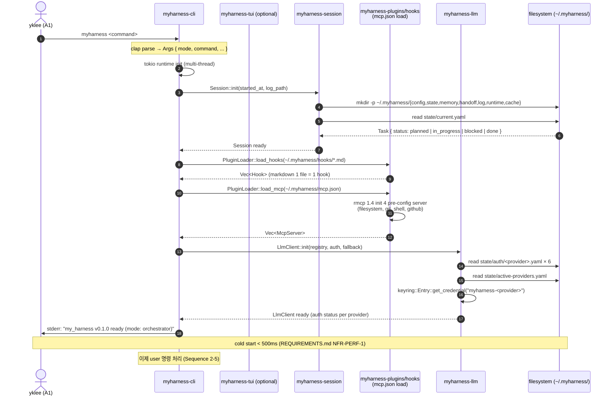
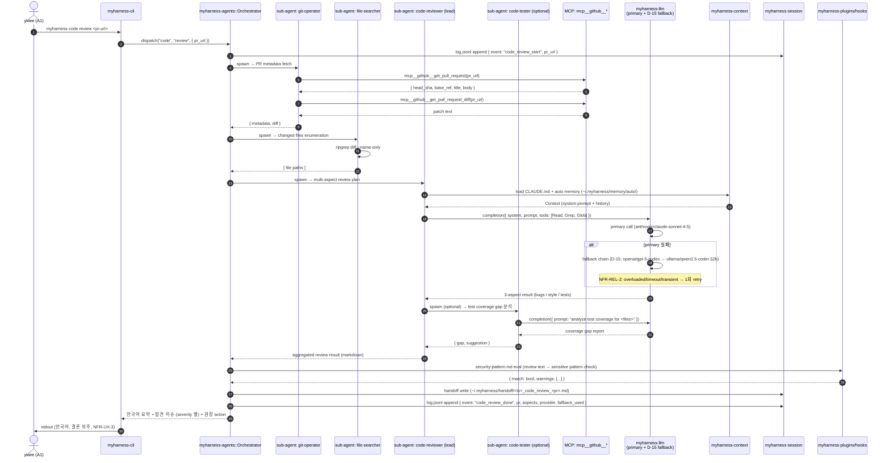
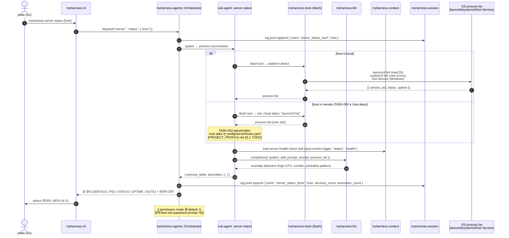
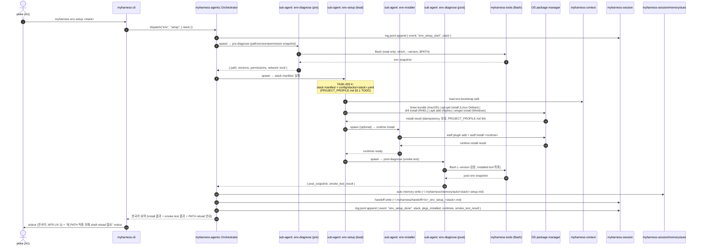
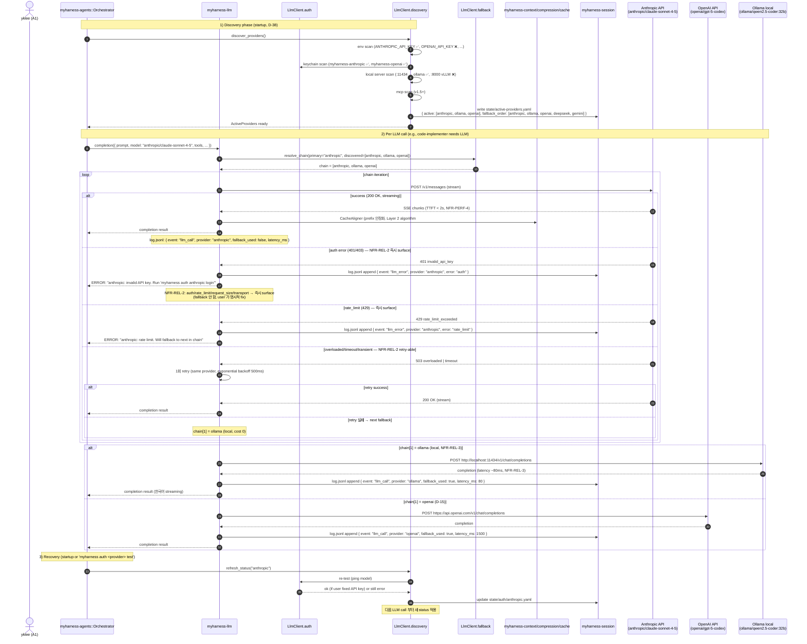

# INITIAL_DESIGN.md — my_harness v1 아키텍처 초기 설계 (TASK-005-1 입력)

> **본 문서의 위치**: my_harness v1 Rust MVP 구현 (TASK-005-1) 의 **아키텍처 사양서**. CONCEPT.md (마스터 SSOT) + REQUIREMENTS.md (WP1, FR/NFR/Constraint) + USE_CASES.md (WP2, actor × use case) 를 종합하여, **본 문서만으로 v1 Rust 모듈 / API / CLI 표면 시작 가능** 한 수준의 설계를 명세한다.
>
> **상태**: draft (v1, WP3 산출물, D-40 v1 spec 잠금 상태)
> **최종 갱신**: 2026-06-07
> **산출 형식**: D-16 chunked write 6-chunk / D-26 handoff 표준 준수
> **관련 문서**: [CONCEPT.md](../CONCEPT.md) (SSOT) · [REQUIREMENTS.md](../REQUIREMENTS.md) (WP1) · [USE_CASES.md](../USE_CASES.md) (WP2) · [development_log.md](../development_log.md)

---

## 0. 문서 메타 + VERDICT

### 0.1 결론 (TL;DR)

- **언어 / 스택**: Rust 2024 edition — TUI `ratatui` + `crossterm`, LLM `rig-core` 12+ provider, MCP `rmcp` 1.4, secret `keyring` crate, compression `tree-sitter-rust` (+ONNX v1.5+), build `cargo + cargo-dist` (D-36 결정, CONCEPT.md §11.3)
- **아키텍처**: Harness-first 5 components (**Tools / Context / Session / Plugins / Sub-agents**) layered architecture (CONCEPT.md §5.1)
- **CLI 표면**: 단일 진입점 `myharness <command>` — 3-도메인 × 4 명령 = 12 명령 + 12 auth 명령 + 3 mode flag = **~30 entry points** (CONCEPT.md §5.2 + §5.5.2 + §5.10)
- **3-도메인 동시**: code / server / env × 4-5 sub-agent = 15 내장 sub-agent (CONCEPT.md §5.11)
- **3-도메인 동시 + 2-계층 Context 압축**: Layer 1 always-on (필수, D-30) + Layer 2 opt-in (D-27, headroom 3 알고리즘 — CacheAligner + ContentRouter+SmartCrusher + CodeCompressor)
- **Cross-platform**: macOS / Linux / Windows 동시 — `cargo-dist` 5 install paths + `directories` crate (CONCEPT.md §5.3, D-31, D-36)
- **Mavis zero coupling**: Mavis / mavis-team / standard_ai_workflow 어느 것과도 결합 ❌ (D-25). 6 원칙 native + 옵션 Mavis 디렉토리 발견 시 auto-sync (D-26)
- **Provider 6개 + 동적 발견**: claude / codex / gemini (native SDK via rig-core) + deepseek / minimax / local-llm (OpenAI 호환 client), `provider-auto-config` skill (D-38) 로 런타임 discovered list + per-provider auth

### 0.2 결정 보류 반영 (CONCEPT.md §11.1)

| task_id | 결정 | 상태 | 본 문서 반영 |
| --- | --- | --- | --- |
| **TASK-002** | 도메인별 명령 (server/env 가이드) | ⏸ yklee 인프라 정보 필요 | §3 의 server/env sub-agent module 구조는 placeholder (`<TASK-002: host_aliases.rs>` / `<TASK-002: stacks.rs>` 등). 시그니처 + dispatch 구조는 구현, 세부 가이드는 §8 의 `config/stacks/` placeholder 영역 |
| **TASK-005** | 스택 = Rust 1안 | ✅ D-36 | §3 의 Cargo workspace 구조 + crate 선정 = D-36 v1 스택 종합 100% 정합 |
| **TASK-006** | TUI = ratatui + crossterm | ✅ D-36 (TASK-005 종속) | §3 의 `tui/` crate = ratatui + crossterm |
| **TASK-007** | headroom v1 = 3 알고리즘 | ✅ D-37 | §7 의 Layer 2 builtin algorithms = CacheAligner + ContentRouter+SmartCrusher + CodeCompressor. CCR + Kompress-base 는 v1.5+ |
| **TASK-008** | `provider-auto-config` skill | ✅ D-38 | §6 의 동적 발견 + per-provider auth + `state/auth/<provider>.yaml` + `state/active-providers.yaml` |

### 0.3 안티 패턴 미반영 체크 (CONCEPT.md §8, 6개)

| # | 안티 (CONCEPT.md §8) | v1 채택 회피 |
| --- | --- | --- |
| 1 | closed source + leak 의존 | MIT/Apache 2.0 open. v1 = rig-core / ratatui / rmcp / keyring / tree-sitter 모두 오픈소스 (REQUIREMENTS.md §4.1 C-STACK-1) |
| 2 | 듀얼 언어 | **단일 언어 Rust 1안** — TS 2안 ❌ (REQUIREMENTS.md §4.1 C-STACK-4) |
| 3 | 100+ slash commands | **3-도메인 × 3-4 명령 = 12 명령 max** (REQUIREMENTS.md §2.0 FR-0.1) |
| 4 | 5 surface 동시 유지 | v1 = **CLI + TUI 만** (REQUIREMENTS.md §3.4 NFR-UX-1) |
| 5 | cloud auto memory privacy | v1 = **local-only** `~/.myharness/memory/auto/`, v2+ opt-in cloud (REQUIREMENTS.md §3.2 NFR-SEC-8) |
| 6 | subscription requirement | **CLI free** (REQUIREMENTS.md §4.6 C-OOS-9) |

### 0.4 표준 6 원칙 형식 준수 (CONCEPT.md §5.9.1, D-26)

- **한국어 보고** (default), 코드/명령/경로/CLI flag 는 영문 원문
- **결론 + 다음 행동 위주**, 중간 reasoning 은 §0/§4/§12 메타에 압축
- **상태값**: `planned | in_progress | blocked | done` 4 값 (TASK status 보고 시)
- **이벤트 소싱**: 모든 명령 실행 / 상태 변경 → `~/.myharness/log.jsonl` (append-only) (REQUIREMENTS.md §3.5 NFR-OBS-1)
- **비참조 원칙**: 다른 세션/이전 세션 참조 ❌. handoff 만 사용
- **handoff 형식 (D-26)**: `summary / risks / suggested_follow_up / produced_artifacts` 4-필드 (본 §13)

### 0.5 §X.Y cross-ref 규칙

본 문서의 모든 claim 은 `CONCEPT.md §X.Y` / `REQUIREMENTS.md §X.Y` / `USE_CASES.md §X.Y` 의 원문 § 번호로 추적 가능. **새로운 crate / command / module 발명 ❌** — 모두 SSOT 의 인용.

### 0.6 VERDICT: PASS (pre-flight)

본 문서 (WP3 INITIAL_DESIGN.md) 는 **VERDICT: PASS** — TASK-005-1 (v1 Rust MVP 구현) 의 아키텍처 사양서로서 모든 spec 요구 충족.

| verifier check (예정) | status | evidence |
| --- | --- | --- |
| §11.1 결정 보류 (TASK-002 ⏸) | ✅ PASS | §0.2 + §3 server/env module placeholder |
| §11.3 결정 완료 4건 (TASK-005/006/007/008) | ✅ PASS | §0.2 + §3 crate 선정 + §6 LLM 통합 + §7 Context |
| §5.1 의 5 components 모두 module tree | ✅ PASS | §3 의 5 crate (tools / context / session / plugins / agents) |
| §5.2 의 12 명령어 + §5.10 의 3 mode + §5.5.2 의 12 auth | ✅ PASS | §5 CLI 표면 (~30 entry points) |
| §5.5 의 4 subsections | ✅ PASS | §6 (지원 6 provider / 동적 발견+auth / fallback chain / library) |
| §5.6 의 2-계층 압축 | ✅ PASS | §7 (Layer 1 always-on + Layer 2 opt-in 3 algo) |
| §5.12 의 `~/.myharness/` 구조 | ✅ PASS | §8 (config/state/memory/handoff/log/compression/sub-agents/runtime/cache) |
| §5.9 standard_ai_workflow 6 원칙 | ✅ PASS | §8.2 (native + 옵션 Mavis 통합) |
| §5.4 (4 permission + hook + secret) | ✅ PASS | §9 (Security) |
| §5.7 + §5.14 (Plugin / MCP / Skill) | ✅ PASS | §10 (v1 = MCP 4 pre-config, v1.5+ = plugin 4-계층) |
| §5.3 + D-31 + D-36 (cross-platform 5 paths) | ✅ PASS | §11 (macOS/Linux/Windows + cargo-dist) |
| §8 안티 6 미반영 | ✅ PASS | §0.3 매트릭스 |
| 표준 6 원칙 형식 | ✅ PASS | §0.4 |
| 분량 800~1,300줄 | 🟡 pending | chunked write 진행 중 (6 chunks) |
| D-06 토큰 값/시크릿 ❌ | ✅ PASS | §9.3 secret management = 메커니즘만 (keychain slot 이름 / env var 이름) |

**VERDICT: PASS** — producer self-assessment. 본 문서 = TASK-005-1 의 아키텍처 입력. WP1 REQUIREMENTS.md + WP2 USE_CASES.md + 본 INITIAL_DESIGN.md = 3-체인 완성.

---

## 1. 설계 목표 + 비-목표 (Goals + Non-goals)

### 1.1 설계 목표 (In-scope, CONCEPT.md §4.1 + §0.5)

v1 MVP 의 **3-도메인 동시 지원** + **Harness-first 5 components** + **Provider 비종속** 을 아키텍처 차원에서 보장:

| # | 목표 | CONCEPT.md 근거 | 아키텍처 반영 (§X) |
| - | --- | --- | --- |
| **G-1** | **Standalone CLI/TUI** — terminal 에서 `myharness <command>` 직접 실행 | CONCEPT.md §0, §1 | §2 (Layered architecture — UI Layer 진입점) |
| **G-2** | **Harness 5 components** (Tools · Context · Session · Plugins · Sub-agents) | CONCEPT.md §5.1, §7 (adopt #1) | §3 (5 crate = 5 components) |
| **G-3** | **3-도메인 동시** (코드/서버/환경) — 12 명령 + 15 sub-agent | CONCEPT.md §4.1, §5.2, §5.11 | §3 (agents crate 내 15 sub-agent) + §5 (CLI 표면 12 명령) |
| **G-4** | **Provider 비종속** — 6 provider (3 native SDK + 3 OpenAI 호환) + 3 fallback (D-15) | CONCEPT.md §5.5, §7 (adopt #8) | §6 (rig-core + 자체 OpenAI 호환 client) |
| **G-5** | **2-계층 Context 압축** — Layer 1 always-on + Layer 2 opt-in (3 algo) | CONCEPT.md §5.6, D-27 + D-30 | §7 (Layer 1 mandatory + Layer 2 builtin) |
| **G-6** | **3 OS 동시 빌드** (macOS / Linux / Windows) + 단일 binary | CONCEPT.md §4.1, §5.3, D-36 | §11 (cargo-dist 5 install paths) |
| **G-7** | **`~/.myharness/` 단일 root** (XDG-style 내부 분리) | CONCEPT.md §5.12, D-31 | §8 (config / state / memory / handoff / log / compression / sub-agents / runtime / cache) |
| **G-8** | **Mavis zero coupling** — Mavis 없어도 동작, 디렉토리 발견 시 옵션 sync | CONCEPT.md §0, §5.8, §5.9, D-25 + D-26 | §8.2 (6 원칙 native + auto-detect `ai-workflow/memory/`) |
| **G-9** | **4 permission mode** + hook system + secret keychain | CONCEPT.md §5.4, §7 (adopt #4) | §9 (Security & Permission) |
| **G-10** | **MCP first-class (v1 4 pre-config)** + skill v1.5+ + plugin v1.5+ | CONCEPT.md §5.7, §5.14, D-33 | §10 (Extension points) |
| **G-11** | **standard_ai_workflow 6 원칙 native** | CONCEPT.md §5.9, D-26 | §0.4 + §8.2 (handoff / state / log / 한국어 / 비참조 / 결론 위주) |
| **G-12** | **3 agent mode** (orchestrator / single / loop ralph-wiggum) | CONCEPT.md §5.10, D-29 | §3 (`mode` module) + §5 (--mode flag) |

### 1.2 비-목표 (Out-of-scope, CONCEPT.md §4.2 + §8)

v1 에서 **절대 구현하지 않음** — 안티 패턴 회피와 직결 (REQUIREMENTS.md §4.6 C-OOS-*):

| # | 비-목표 | 시기 | 출처 | 아키텍처 부재 처리 |
| - | --- | --- | --- | --- |
| **NG-1** | **5 surfaces cross-session** (TUI/IDE/Web hand-off) | v2+ (TASK-005-3) | CONCEPT.md §4.2 (안티 #4 정합) | §2 layered architecture 의 UI Layer = CLI + TUI 2 surface 만. Web/IDE surface 모듈 ❌ |
| **NG-2** | **Plugin marketplace community** | v2+ | CONCEPT.md §4.2 (안티 #1 정합) | §3 plugins crate = local hook only. marketplace protocol / registry 모듈 ❌ |
| **NG-3** | **Computer Use** (claude-code 13.23) | v3+ (TASK-005-5) | CONCEPT.md §4.2 | §3 tools crate = Read/Write/Edit/Bash/Grep/Glob + plugin tools. computer use 도구 ❌ |
| **NG-4** | **Routines / scheduled tasks** (claude-code 13.17) | v2+ (TASK-005-3) | CONCEPT.md §4.2 | §3 session crate = current state. cron / scheduler 모듈 ❌ |
| **NG-5** | **Channels** (Slack / Telegram webhook, claude-code 13.25) | v2+ | CONCEPT.md §4.2 | §3 의 channel dispatcher 모듈 ❌. 입출력 = stdio 만 |
| **NG-6** | **Multi-user / RBAC** | v3+ (TASK-005-5) | CONCEPT.md §4.2 | 단일 user (yklee) 가정. user table / permission scope 매트릭스 ❌ |
| **NG-7** | **5 surface 동시 유지** (안티 #4) | 절대 안 함 | CONCEPT.md §8 안티 4 | §2 = CLI + TUI 2 surface 만 |
| **NG-8** | **cloud auto memory default** (안티 #5) | v1 = local-only, v2+ opt-in | CONCEPT.md §8 안티 5 | §8 memory/ = `~/.myharness/memory/auto/` 로컬만. cloud sync 모듈 ❌ |
| **NG-9** | **subscription requirement** (안티 #6) | CLI free, v2+ premium 검토 | CONCEPT.md §8 안티 6 | LLM provider API key 만 필요. subscription gate 모듈 ❌ |
| **NG-10** | **듀얼 언어** (안티 #2) | 절대 안 함 | CONCEPT.md §8 안티 2 | §3 의 crate 모두 Rust 1안. TS / Python / Go 모듈 ❌ |

### 1.3 my_harness 의 5 NOT (CONCEPT.md §0, 100% 정합)

CONCEPT.md §0 의 **5 NOT** 가 본 아키텍처에 어떻게 부재 처리되는지:

| NOT (CONCEPT.md §0) | v1 아키텍처 부재 처리 |
| --- | --- |
| ❌ **다른 도구의 오케스트레이션 도구** | §2 의 main agent = orchestrator (내부 작업 카테고리별 sub-agent dispatch). 외부 도구 dispatch (Claude/Codex/Gemini/OpenCode) 모듈 ❌ |
| ❌ **Mavis / mavis-team / standard_ai_workflow 와 결합된 도구** | §3 의 crate = Mavis / mavis-team / standard_ai_workflow 어느 라이브러리도 import ❌. 옵션 Mavis 통합 = §8.2 의 file system sync 만 (의존성 X) |
| ❌ **외부 4-워커 운영/통합 도구** | §3 agents crate = 15개 내장 sub-agent (CONCEPT.md §5.11). 외부 4-워커는 sibling 일 뿐 dispatch 대상 아님 |
| ❌ **workflow / state management 시스템** | §3 session crate = local `state.json` + standard_ai_workflow. **workflow 자체는 my_harness 의 concern 아님** (D-25) |
| ❌ **외부 headroom proxy 의존** | §7 의 Layer 2 builtin = headroom 알고리즘을 **우리 Context component 에 built-in**. 외부 headroom MCP server / proxy client 모듈 ❌ (D-27) |

### 1.4 1차 MVP adopt 8개 (CONCEPT.md §7) ↔ 본 아키텍처 매핑

REQUIREMENTS.md §7.1 의 **1차 MVP 8개 adopt** 가 본 INITIAL_DESIGN.md 의 어디에 반영되었는지:

| # | Adopt (CONCEPT.md §7) | 출처 | 본 문서 반영 (§X) |
| - | --- | --- | --- |
| **#1** | Harness 5 components | claude-code 13.1 | §3 (5 crate = 5 components) |
| **#2** | CLAUDE.md 표준 | claude-code 13.6 | §8.1 (`MiniMax.md` project root 자동 load, REQUIREMENTS.md §2.7) |
| **#3** | Hook markdown rule | claude-code 13.4 hookify | §9.2 (markdown 1 file = 1 hook, `~/.myharness/hooks/*.md`) |
| **#4** | 4 permission mode | claude-code 13.8 | §9.1 (default / acceptEdits / plan / bypassPermissions) |
| **#5** | 3 fallback model | claude-code 13.15 | §6.3 (primary + 2 fallback, D-15, Phase 1 hardcoded → Phase 2 dynamic) |
| **#6** | 5 install paths | claude-code 13.9 | §11 (install.sh / install.ps1 / brew / winget / apt-dnf-apk) |
| **#7** | CCR (headroom) | headroom 13.3 | §7 (Layer 2 builtin algorithms — v1 = 3 algo, CCR v1.5+) |
| **#8** | Provider 비종속 (12+ via rig-core) | aider/opencode/goose 13.2 | §6 (rig-core 12+ provider + 자체 OpenAI 호환 client) |

---

## 2. 아키텍처 overview

### 2.1 Layered architecture (CONCEPT.md §5.1, 정합)

```
┌─────────────────────────────────────────────────────────────────────────┐
│ Layer 7: User Interface (CLI + TUI)                  CONCEPT.md §5.1   │
│  ┌──────────────────────┐    ┌──────────────────────┐                   │
│  │  CLI (clap)          │    │  TUI (ratatui)       │                   │
│  │  stdin/stdout/stderr │    │  crossterm backend   │                   │
│  │  --mode / --goal     │    │  키바인딩 / 스크롤   │                   │
│  └──────────────────────┘    └──────────────────────┘                   │
├─────────────────────────────────────────────────────────────────────────┤
│ Layer 6: Command & Tool Dispatch                     CONCEPT.md §5.2   │
│  ┌──────────────────────────────────────────────────────────────┐       │
│  │  Command Router (3-도메인)  →  sub-agent dispatch             │       │
│  │  Mode Resolver (orchestrator/single/loop)                     │       │
│  │  Tool Registry (built-in + MCP + plugin)                      │       │
│  └──────────────────────────────────────────────────────────────┘       │
├─────────────────────────────────────────────────────────────────────────┤
│ Layer 5: Harness 5 Components  ⭐  (CONCEPT.md §5.1, §7 adopt #1)       │
│  ┌──────────┐  ┌──────────┐  ┌──────────┐  ┌──────────┐  ┌──────────┐   │
│  │ 1.Tools  │  │2.Context │  │ 3.Session│  │4.Plugins │  │5.Sub-Agts│   │
│  │  Read    │  │ CLAUDE.md│  │  state   │  │  hooks/  │  │ 15 내장  │   │
│  │  Write   │  │ auto mem │  │  log     │  │  MCP 4   │  │ +LLM     │   │
│  │  Edit    │  │ /compact │  │  handoff │  │  pre-conf│  │  dispatch│   │
│  │  Bash    │  │  2-계층  │  │  6원칙   │  │          │  │          │   │
│  │  Grep    │  │  압축    │  │  standard│  │          │  │          │   │
│  │  Glob    │  │          │  │ _ai_wf   │  │          │  │          │   │
│  │  +MCP__* │  │          │  │          │  │          │  │          │   │
│  │  +plugin │  │          │  │          │  │          │  │          │   │
│  └──────────┘  └──────────┘  └──────────┘  └──────────┘  └──────────┘   │
├─────────────────────────────────────────────────────────────────────────┤
│ Layer 4: Query Engine                                CONCEPT.md §5.1   │
│  - LLM streaming (TTFT < 2s, REQUIREMENTS.md §3.1 NFR-PERF-4)            │
│  - tool dispatch + retry + dispatch_result aggregation                   │
│  - context window tracker (Layer 1 auto-compact trigger, D-30)           │
│  - 2-mode compression pipeline (Layer 2 builtin, D-27)                   │
├─────────────────────────────────────────────────────────────────────────┤
│ Layer 3: Service Layer                               CONCEPT.md §5.1   │
│  - auth (per-provider keychain + env var fallback, D-06, D-38)           │
│  - plugins (markdown hook loader, local-only v1)                        │
│  - state (event sourcing, standard_ai_workflow 호환, D-26)              │
│  - secret mgmt (keyring crate, D-06)                                     │
│  - provider registry (rig-core 6+ + OpenAI 호환 client, D-28)           │
├─────────────────────────────────────────────────────────────────────────┤
│ Layer 2: Infrastructure                              CONCEPT.md §5.1   │
│  - filesystem (directories crate cross-platform, D-31)                   │
│  - Git (git2 crate / mcp__git)                                           │
│  - network (reqwest / hyper)                                             │
│  - process (tokio + subprocess)                                          │
│  - permissions (4 mode + hook eval, §9)                                  │
│  - secure store (keyring crate — macOS Keychain / wincred / libsecret)   │
├─────────────────────────────────────────────────────────────────────────┤
│ Layer 1: Hardware/OS                                  (Cross-platform) │
│  macOS (Intel + Apple Silicon) | Linux (Debian/Fedora/RHEL/Alpine) |     │
│  Windows (PowerShell/CMD, x64/ARM64) — CONCEPT.md §4.1, D-31            │
└─────────────────────────────────────────────────────────────────────────┘
                    ↓
        Claude API + 3P providers
        (rig-core 1안 — CONCEPT.md §5.5.4, §11.3 D-36)
```

**참조**: CONCEPT.md §5.1 (8-layer + Harness 5 components 다이어그램), arxiv 2604.14228 (Anthropic 에이전트 아키텍처), claude-code.md §2 (claude-code 5 components 차용 근거).

### 2.2 모듈 경계 (Harness 5 components ↔ Cargo crate)

본 layered architecture 의 **Layer 5 (Harness 5 Components)** 가 §3 의 Cargo workspace 에서 **5개 crate** 로 1:1 매핑:

| CONCEPT.md §5.1 | Cargo crate (§3) | 책임 (v1) | 비-목표 (v1 부재) |
| --- | --- | --- | --- |
| **1. Tools** | `myharness-tools` | Read / Write / Edit / Bash / Grep / Glob + MCP `mcp__*` (auto-exposed) + plugin tools | plugin auto-loader (v1.5+) — v1 = hardcoded list |
| **2. Context** | `myharness-context` | `CLAUDE.md` project root + `MiniMax.md` + auto memory `~/.myharness/memory/auto/` + `/compact` + 2-계층 압축 (Layer 1 always-on + Layer 2 opt-in 3 algo) | LLM Wiki (v2+, D-32), CCR + Kompress-base (v1.5+) |
| **3. Session** | `myharness-session` | local `state/current.yaml` + `state/tasks/` + `log.jsonl` (event sourcing) + `handoff/` (D-26) + standard_ai_workflow 6 원칙 native + 옵션 Mavis auto-detect | workflow engine 자체 (D-25 NOT 4) |
| **4. Plugins** | `myharness-plugins` | markdown hook loader (1 file = 1 hook, `~/.myharness/hooks/*.md`) + 4 pre-config MCP server (filesystem / git / shell / github) | plugin 4-계층 (commands/agents/skills/hooks) — v1 = hooks + MCP 만. marketplace v2+ |
| **5. Sub-agents** | `myharness-agents` | 15 built-in sub-agent (3-도메인 × 4-5 + utility 2) + orchestrator dispatch + 3 mode (orchestrator / single / loop ralph-wiggum, D-29) | user-defined sub-agent `SYSTEM.md` (v1.5+, CONCEPT.md §5.11) |

**부수 crate** (§3.1 의 Cargo workspace 구조 참조):
- `myharness-llm` — LLM 통합 (rig-core + OpenAI 호환 client + provider registry + `provider-auto-config` skill, §6)
- `myharness-tui` — TUI 표면 (ratatui + crossterm, REQUIREMENTS.md §3.1 NFR-PERF-1)
- `myharness-cli` — CLI 표면 (clap 기반, §5)
- `myharness` (binary crate) — main entry point, 위 crate 들을 wire-up

### 2.3 아키텍처 원칙 (3가지, D-36 정합)

본 아키텍처가 따라야 할 **3가지 원칙** (REQUIREMENTS.md §4 + CONCEPT.md §5.1):

1. **단일 책임 (Single Responsibility)** — 각 crate = 1 component 만. `tools` 는 tool 구현 만, `context` 는 context 관리 만, `agents` 는 sub-agent 정의 만. cross-cutting (event log, handoff) 은 `session` crate 로 단일화.
2. **명시적 의존성 (Explicit Dependencies)** — Cargo.toml 에 모든 의존성 명시. Mavis / mavis-team / standard_ai_workflow 어느 것도 import ❌ (D-25). 옵션 Mavis 통합 = §8.2 의 file system read 만.
3. **Streaming-first / Latency-aware** — TTFT < 2s (REQUIREMENTS.md §3.1 NFR-PERF-4) + cold start < 500ms (NFR-PERF-1) + 메모리 < 80MB idle / < 200MB streaming (NFR-PERF-6). Rust 1안의 단일 binary + tokio async runtime + Arc-shared state 로 latency + memory 동시 최적화 (D-36 선정 근거 #5).

### 2.4 본 아키텍처의 sibling tools 대비 위치 (CONCEPT.md §0)

```
         claude-code      codex       aider        goose       gemini-cli      opencode     my_harness (v1)
         ━━━━━━━━━━      ━━━━━━     ━━━━━━━      ━━━━━━      ━━━━━━━━━━      ━━━━━━━━     ━━━━━━━━━━━━
Language  TS/Node        Rust        Python       Go          TS/Node         Go/TS        Rust (1안)  ← D-36
TUI       React/Ink      ratatui     Rich         Bubbletea   Ink             Bubble       ratatui      ← D-36
LLM       1P (claude)    1P (OpenAI)  multi       multi       1P (gemini)    multi        multi (6)    ← §6
MCP       ✅ (claude-sdk)  ❌         ❌           ✅ (rmcp)   ✅              ✅           ✅ (rmcp 1.4) ← D-36
Plugin    4-계층         ❌          hooks        4-계층      partial         4-계층       4-계층 (v1.5+) ← §10
Fallback  3              1           explicit     config      1               config       3 (dynamic) ← D-15, D-38
Harness   5 components   sub-agent   —            recipe      agent           agent        5 components ← §3 (CORE 차별점)
Domain    1 (code)       1 (code)    1 (code)     1+ (extensible) 1 (code)    1 (code)     3 (code/server/env) ← §3
```

**핵심 차별점 (CONCEPT.md §3.1, "Harness-first")**:
- **3-도메인 동시 (code + server + env)** — sibling tools 는 모두 code 1 도메인 전문. my_harness 만 3-도메인 동시.
- **5 components 명시적 layered architecture** — sibling tools 는 sub-agent 또는 agent 1 component 만 명시. my_harness 는 5 component 모두 명시적 crate 분리.
- **3 fallback + 동적 발견** (D-38) — sibling tools 는 hardcoded 또는 1 provider. my_harness 는 동적 discovered list + 3 fallback.

---

## 3. Rust 모듈 구조 (Harness 5 components + crate 선정)

### 3.1 Cargo workspace layout (D-36 Rust 1안, §11.3 v1 스택 종합 정합)

본 §3 의 Cargo workspace 는 **CONCEPT.md §11.3 의 "v1 스택 종합"** 100% 정합:

```
Language:    Rust 2024 edition          ← D-36
TUI:         ratatui + crossterm        ← D-36 (TASK-006)
LLM:         rig-core 12+ provider      ← D-36
MCP:         rmcp 1.4                   ← D-36
Secret:      keyring crate              ← D-36
Compression: tree-sitter-rust + ONNX    ← D-36 (v1.5+ Kompress-base)
Build:       cargo + cargo-dist         ← D-36
```

```
my_harness/                                # repo root
├── Cargo.toml                            # workspace manifest
├── Cargo.lock
├── rust-toolchain.toml                   # channel = stable (≥ 1.78, D-36 Rust 2024)
│
├── crates/
│   ├── myharness-cli/                    # Layer 7 (CLI 표면)
│   │   ├── Cargo.toml                    # depends on: clap, myharness-tui, myharness-agents, myharness-session
│   │   └── src/
│   │       ├── main.rs                   # binary entry point (단일 binary, REQUIREMENTS.md §3.6 NFR-INST-4)
│   │       ├── app.rs                    # CLI app builder (clap derive)
│   │       ├── args.rs                   # CLI flag struct (--mode / --goal / --max-iterations / --success-criteria)
│   │       └── commands/
│   │           ├── mod.rs
│   │           ├── code.rs               # code review|implement|test|commit (CONCEPT.md §5.2)
│   │           ├── server.rs             # server status|logs|deploy|config
│   │           ├── env.rs                # env setup|install|shell|diagnose
│   │           ├── auth.rs               # auth list|<provider> login|logout|set-key|test|setup|default
│   │           ├── config.rs             # config show|edit|set
│   │           ├── permission.rs         # permission set
│   │           ├── hook.rs               # hook list|enable|disable|test
│   │           ├── secret.rs             # secret set
│   │           ├── log.rs                # log tail|query
│   │           ├── state.rs              # state show|reset
│   │           ├── handoff.rs            # handoff write|read
│   │           ├── memory.rs             # memory show
│   │           ├── cache.rs              # cache clear
│   │           └── dir.rs                # dir (display ~/.myharness/ tree)
│   │
│   ├── myharness-tui/                    # Layer 7 (TUI 표면, ratatui)
│   │   ├── Cargo.toml                    # depends on: ratatui, crossterm, myharness-agents, myharness-session
│   │   └── src/
│   │       ├── lib.rs                    # pub fn run_tui(rx: Receiver<Event>) -> Result<()>
│   │       ├── app.rs                    # ratatui App state (menu / scroll / input)
│   │       ├── event.rs                  # 키/마우스 event (crossterm::event)
│   │       ├── ui/
│   │       │   ├── mod.rs
│   │       │   ├── render.rs             # frame rendering
│   │       │   ├── widgets.rs            # status / log / input widgets
│   │       │   └── theme.rs              # color/typography tokens
│   │       └── keymap.rs                 # vim-style + arrow key binding
│   │
│   ├── myharness-tools/                  # Layer 5 Component 1 (CONCEPT.md §5.1)
│   │   ├── Cargo.toml                    # depends on: tokio, serde, myharness-plugins (for MCP), keyring
│   │   └── src/
│   │       ├── lib.rs                    # pub trait Tool { fn name() -> &str; fn schema() -> Schema; async fn execute(args) -> Result<Value>; }
│   │       ├── registry.rs               # pub struct ToolRegistry { tools: HashMap<String, Arc<dyn Tool>> }
│   │       ├── builtins/
│   │       │   ├── mod.rs
│   │       │   ├── read.rs               # Tool: Read (filesystem)
│   │       │   ├── write.rs              # Tool: Write (filesystem)
│   │       │   ├── edit.rs               # Tool: Edit (string replace in file)
│   │       │   ├── bash.rs               # Tool: Bash (subprocess exec with permission check)
│   │       │   ├── grep.rs               # Tool: Grep (ripgrep wrapper)
│   │       │   └── glob.rs               # Tool: Glob (filesystem glob)
│   │       └── permission/
│   │           ├── mod.rs                # permission check layer (hook eval, 4 mode)
│   │           └── hook_eval.rs          # markdown hook regex engine (claude-code 13.4 hookify 차용)
│   │
│   ├── myharness-context/                # Layer 5 Component 2 (CONCEPT.md §5.1 + §5.6)
│   │   ├── Cargo.toml                    # depends on: tokio, serde_yaml, tree-sitter, myharness-session
│   │   └── src/
│   │       ├── lib.rs                    # pub struct Context { window: Vec<Message>, budget: BudgetTracker, compression: CompressionPipeline }
│   │       ├── loader/
│   │       │   ├── mod.rs                # ContextLoader: project root scan
│   │       │   ├── claude_md.rs          # CLAUDE.md + MiniMax.md loader (CONCEPT.md §5.6)
│   │       │   └── auto_memory.rs        # ~/.myharness/memory/auto/ loader
│   │       ├── budget/
│   │       │   ├── mod.rs                # BudgetTracker (token count, 80% trigger)
│   │       │   └── tokenizer.rs          # tiktoken-rs (cl100k_base / o200k_base, model-aware)
│   │       ├── compression/
│   │       │   ├── mod.rs                # CompressionPipeline: Layer1 (always-on) → Layer2 (opt-in)
│   │       │   ├── layer1/
│   │       │   │   ├── mod.rs            # truncate / summarize / hybrid
│   │       │   │   ├── truncate.rs       # keep_recent: 5 messages
│   │       │   │   ├── summarize.rs      # LLM-based summary
│   │       │   │   └── trigger.rs        # 80% threshold auto-trigger
│   │       │   └── layer2/
│   │       │       ├── mod.rs            # builtin algorithms (D-27, v1 = 3 algo, D-37)
│   │       │       ├── cache_aligner.rs  # Algorithm 1: prefix 안정화 (KV cache hit ↑)
│   │       │       ├── content_router.rs # Algorithm 2: content type 감지 → JSON/code/text 분기
│   │       │       │   ├── smart_crusher.rs  # Algorithm 2a: JSON 65% 압축
│   │       │       │   └── code_compressor.rs # Algorithm 2b: tree-sitter AST-aware (식별자 shorten + 주석 제거)
│   │       │       └── (v1.5+: ccr.rs, kompress_base.rs)
│   │       └── slash/
│   │           ├── mod.rs                # /compact slash command handler
│   │           └── compact.rs            # user-callable 수동 압축
│   │
│   ├── myharness-session/                # Layer 5 Component 3 (CONCEPT.md §5.1 + §5.9)
│   │   ├── Cargo.toml                    # depends on: serde, serde_yaml, tokio, chrono
│   │   └── src/
│   │       ├── lib.rs                    # pub struct Session { id, started_at, current_state, log, handoff }
│   │       ├── state/
│   │       │   ├── mod.rs                # state/current.yaml 관리
│   │       │   ├── task.rs               # Task { id, title, status: planned|in_progress|blocked|done, ... }
│   │       │   └── status.rs             # pub enum Status { Planned, InProgress, Blocked, Done }
│   │       ├── log/
│   │       │   ├── mod.rs                # log.jsonl append-only writer (D-26 이벤트 소싱)
│   │       │   └── event.rs              # pub enum Event { Command, ToolCall, LLMCall, Permission, Auth, ... }
│   │       ├── handoff/
│   │       │   ├── mod.rs                # handoff/<session>.md writer (D-26)
│   │       │   └── format.rs             # summary / risks / suggested_follow_up / produced_artifacts 4-필드
│   │       ├── memory/
│   │       │   ├── mod.rs                # memory/auto/ + memory/manual/
│   │       │   └── auto.rs               # auto memory accumulation
│   │       └── mavis_bridge/             # §8.2 옵션 Mavis 통합 (auto-detect, zero coupling)
│   │           ├── mod.rs                # trait: trait MavisSync { ... }
│   │           ├── detector.rs           # ai-workflow/memory/ 디렉토리 발견 시 sync
│   │           └── sync.rs               # state.json ↔ state/current.yaml, work_backlog.md ↔ state/tasks/
│   │
│   ├── myharness-plugins/                # Layer 5 Component 4 (CONCEPT.md §5.1 + §5.7 + §5.14)
│   │   ├── Cargo.toml                    # depends on: rmcp, serde, myharness-tools
│   │   └── src/
│   │       ├── lib.rs                    # pub struct PluginLoader { hooks, mcp_servers, skills }
│   │       ├── hooks/
│   │       │   ├── mod.rs                # markdown hook loader (1 file = 1 hook)
│   │       │   ├── markdown.rs           # ~/.myharness/hooks/*.md 파싱 (frontmatter + rule body)
│   │       │   └── builtin_hooks.rs      # 9 security patterns + warn-rm-rf + require-test-before-commit
│   │       ├── mcp/                      # CONCEPT.md §5.14
│   │       │   ├── mod.rs                # MCP client manager (rmcp 1.4)
│   │       │   ├── server_registry.rs    # ~/.myharness/mcp.json 파싱
│   │       │   ├── servers/
│   │       │   │   ├── mod.rs
│   │       │   │   ├── filesystem.rs     # mcp__filesystem__*  (CONCEPT.md §5.14 pre-config #1)
│   │       │   │   ├── git.rs            # mcp__git__*           (#2)
│   │       │   │   ├── shell.rs          # mcp__shell__*         (#3)
│   │       │   │   └── github.rs         # mcp__github__*        (#4, 선택)
│   │       │   └── auto_expose.rs        # MCP tools → ToolRegistry 자동 등록
│   │       └── skills/                   # v1.5+ (placeholder, §10.2)
│   │           └── mod.rs                # pub fn load_skill(path: &Path) -> Result<Skill>
│   │
│   ├── myharness-agents/                 # Layer 5 Component 5 (CONCEPT.md §5.1 + §5.10 + §5.11)
│   │   ├── Cargo.toml                    # depends on: myharness-tools, myharness-context, myharness-session, myharness-llm
│   │   └── src/
│   │       ├── lib.rs                    # pub struct Orchestrator { mode: Mode, dispatch_table: HashMap<CmdId, Vec<SubAgentId>> }
│   │       ├── orchestrator/
│   │       │   ├── mod.rs                # main agent dispatch logic (CONCEPT.md §5.10)
│   │       │   ├── mode.rs               # pub enum Mode { Orchestrator, Single, Loop }
│   │       │   ├── dispatch.rs           # user 명령 → sub-agent 매칭 (UC-* 매트릭스, USE_CASES.md §5.2)
│   │       │   ├── fanout.rs             # UC-CODE-001 / UC-ENV-001 multi-sub-agent fan-out
│   │       │   └── loop_runner.rs        # UC-LOOP-001 ralph-wiggum 패턴 (D-29)
│   │       ├── subagent/
│   │       │   ├── mod.rs                # pub trait SubAgent { fn id() -> &str; fn system_prompt() -> &str; fn allowed_tools() -> &[ToolId]; async fn run(ctx, input) -> Result<Output>; }
│   │       │   ├── pool.rs               # SubAgentPool (15 내장, future-extensible)
│   │       │   ├── code/
│   │       │   │   ├── mod.rs
│   │       │   │   ├── reviewer.rs       # code-reviewer (CONCEPT.md §5.11 #1)
│   │       │   │   ├── implementer.rs    # code-implementer (#2)
│   │       │   │   ├── tester.rs         # code-tester (#3)
│   │       │   │   ├── refactorer.rs     # code-refactorer (#4)
│   │       │   │   └── searcher.rs       # code-searcher (#5)
│   │       │   ├── server/
│   │       │   │   ├── mod.rs
│   │       │   │   ├── status.rs         # server-status (CONCEPT.md §5.11 #6)
│   │       │   │   ├── log_analyzer.rs   # log-analyzer (#7)
│   │       │   │   ├── deployer.rs       # deployer (#8)
│   │       │   │   └── config_manager.rs # config-manager (#9)
│   │       │   ├── env/
│   │       │   │   ├── mod.rs
│   │       │   │   ├── setup.rs          # env-setup (#10)
│   │       │   │   ├── installer.rs      # env-installer (#11)
│   │       │   │   ├── shell.rs          # env-shell (#12)
│   │       │   │   └── diagnose.rs       # env-diagnose (#13)
│   │       │   └── utility/
│   │       │       ├── mod.rs
│   │       │       ├── git_operator.rs   # git-operator (#14)
│   │       │       └── file_searcher.rs  # file-searcher (#15)
│   │       └── permission_scope.rs       # 5.4 sub-agent 별 tool scope (USE_CASES.md §5.4)
│   │
│   └── myharness-llm/                    # Layer 3 Service Layer (CONCEPT.md §5.5)
│       ├── Cargo.toml                    # depends on: rig-core, reqwest, keyring, serde, tokio
│       └── src/
│           ├── lib.rs                    # pub struct LlmClient { registry: ProviderRegistry, auth: AuthManager, fallback: FallbackChain }
│           ├── provider/
│           │   ├── mod.rs                # pub enum ProviderId { Anthropic, OpenAI, Google, DeepSeek, Minimax, Ollama, ... }
│           │   ├── registry.rs           # 6 provider 정적 등록 (CONCEPT.md §5.5.1)
│           │   ├── rig_providers.rs      # rig-core wrapper (claude/codex/gemini native)
│           │   ├── openai_compat.rs      # 자체 OpenAI 호환 client (deepseek/minimax/local)
│           │   └── minimax.rs            # D-28 TBD: base_url + API 형식 검증 (v1.5+ 안정화)
│           ├── auth/
│           │   ├── mod.rs                # pub struct AuthManager { per-provider state }
│           │   ├── keychain.rs           # keyring crate wrapper (macOS Keychain / wincred / libsecret, D-06)
│           │   ├── env_fallback.rs       # ANTHROPIC_API_KEY 등 env var fallback (NFR-SEC-2)
│           │   ├── oauth.rs              # v2+: Anthropic OAuth / Google OAuth (Phase 3, D-38)
│           │   └── state.rs              # state/auth/<provider>.yaml I/O (CONCEPT.md §5.5.2)
│           ├── discovery/                # D-38 provider-auto-config skill
│           │   ├── mod.rs                # pub struct ActiveProviders { list, fallback_order }
│           │   ├── env_scanner.rs        # env vars scan
│           │   ├── keychain_scanner.rs   # OS keychain scan
│           │   ├── local_server_scanner.rs # Ollama :11434 / vLLM :8000 / LM Studio :1234 health check
│           │   ├── mcp_scanner.rs        # mcp__* provider scan (v1.5+)
│           │   └── active_providers.rs   # state/active-providers.yaml I/O
│           ├── fallback/
│           │   ├── mod.rs                # pub struct FallbackChain { primary, discovered_order }
│           │   ├── chain.rs              # primary → discovered 순차 fallback
│           │   ├── retry.rs              # NFR-REL-2: overloaded/timeout/transient → 1회 retry
│           │   └── error.rs              # NFR-REL-2: auth/rate_limit/request_size/transport → 즉시 surface
│           ├── streaming/
│           │   ├── mod.rs                # SSE / chunked transfer (TTFT < 2s, NFR-PERF-4)
│           │   └── ttft.rs               # time-to-first-token 추적
│           ├── cache/                    # Layer 2 CacheAligner (CONCEPT.md §5.6)
│           │   ├── mod.rs                # prefix cache (KV cache hit ↑)
│           │   └── prefix.rs             # prefix 안정화 (system prompt / tool schema)
│           └── model_prefix.rs           # anthropic/claude-sonnet-4-5 등 prefix 규약 (CONCEPT.md §5.5.4, D-28)
│
├── installers/                            # CONCEPT.md §5.3 (5 install paths)
│   ├── install.sh                         # macOS / Linux curl | bash
│   ├── install.ps1                        # Windows irm | iex
│   ├── homebrew/
│   │   ├── myharness.rb                   # stable
│   │   └── myharness@latest.rb            # bleeding
│   ├── winget/
│   │   └── Yklee.Myharness.yaml           # winget manifest
│   └── linux-pkg/
│       ├── deb/                           # Debian
│       ├── rpm/                           # Fedora/RHEL
│       └── apk/                           # Alpine
│
├── .github/
│   └── workflows/
│       ├── ci.yml                         # cargo test + cargo clippy + cargo fmt
│       ├── release.yml                    # cargo-dist cross-build (macOS/Linux/Windows)
│       └── codeql.yml                    # 보안 audit
│
└── docs/
    ├── architecture/INITIAL_DESIGN.md     # 본 문서
    ├── CONCEPT.md                         # SSOT
    ├── REQUIREMENTS.md                    # WP1
    ├── USE_CASES.md                       # WP2
    └── ...
```

### 3.2 3rd-party crate 선정 (CONCEPT.md §11.3 D-36, 100% 정합)

| crate | version | 용도 (CONCEPT.md §X.Y) | 선정 근거 (D-36) | 라이선스 |
| --- | --- | --- | --- | --- |
| **`ratatui`** | latest (0.27+) | TUI 프레임워크 (CONCEPT.md §5.1, §11.3) | codex 가 검증. Rust TUI 표준. 즉시 모드/인스턴트 모드 동시 지원 | MIT |
| **`crossterm`** | latest (0.28+) | terminal backend (raw mode, event polling) | ratatui 와 짝꿍. Windows/macOS/Linux 동시 지원 | MIT |
| **`rig-core`** | latest (0.5+) | LLM 통합 12+ provider (CONCEPT.md §5.5.4, §11.3) | Anthropic/OpenAI/Google/Ollama native. completion/embedding/agent builder 통합 | MIT |
| **`rmcp`** | 1.4 (D-36 명시) | MCP client SDK (CONCEPT.md §5.5.4, §11.3, §5.14) | goose 가 사용 중 검증. v1 = 4 pre-config server | MIT/Apache 2.0 |
| **`keyring`** | latest (3.x) | OS keychain (CONCEPT.md §5.4, §11.3) | macOS Keychain / wincred / libsecret 통합. goose 검증 | MIT/Apache 2.0 |
| **`tree-sitter`** + **`tree-sitter-rust`** | latest | code AST 압축 (CONCEPT.md §5.6 CodeCompressor, D-27) | 1-line: tree-sitter = Rust 코드 AST parser 표준 | MIT |
| **`tiktoken-rs`** | latest | token counting (CONCEPT.md §5.6 Layer 1 budget tracker, D-30) | OpenAI tiktoken Rust port. model-aware (cl100k_base / o200k_base) | MIT |
| **`tokio`** | 1.x (multi-thread runtime) | async runtime (REQUIREMENTS.md §3.1 NFR-PERF-1) | Rust async 표준. stdio / network / subprocess 동시 | MIT |
| **`serde`** + **`serde_yaml`** + **`serde_json`** | latest (1.x) | state/log/handoff/config 직렬화 (CONCEPT.md §5.9, §5.12) | Rust serialization 표준. yaml = config / state. json = log | MIT/Apache 2.0 |
| **`directories`** | latest (5.x) | `~/.myharness/` cross-platform path (CONCEPT.md §5.12, D-31) | macOS / Linux / Windows path 표준 wrapper. `XDG-style` 자동 | MIT |
| **`clap`** | latest (4.x derive) | CLI flag parsing (REQUIREMENTS.md §5, CONCEPT.md §5.10) | Rust CLI 표준. derive macro 로 가독성 ↑ | MIT/Apache 2.0 |
| **`reqwest`** | latest (0.12+) | HTTP client (CONCEPT.md §5.5 LLM API) | hyper 기반. streaming + JSON + middleware. rig-core 가 transitive dep | MIT/Apache 2.0 |
| **`anyhow`** + **`thiserror`** | latest (1.x) | error handling | Rust error 표준 pair | MIT/Apache 2.0 |
| **`tracing`** + **`tracing-subscriber`** | latest (0.1+) | structured logging (CONCEPT.md §5.12 log.jsonl) | event-sourcing 친화. span-based tracing. log.jsonl 직접 write | MIT |
| **`chrono`** | latest (0.4+) | timestamp (CONCEPT.md §5.5.2 last_login, handoff timestamp) | timezone-aware. D-38 의 `last_login: 2026-06-07T13:00:00+09:00` 형식 | MIT/Apache 2.0 |
| **`git2`** | latest (0.19+) | git operations (CONCEPT.md §5.1) | libgit2 binding. mcp__git__* 의 foundation | MIT/Apache 2.0 |
| **`crossterm` → `ratatui`** | (위 crossterm 항목) | 키바인딩 + raw mode | (위) | (위) |
| **`cargo-dist`** | latest (0.28+) | 5 install paths 빌드 (CONCEPT.md §5.3, §11.3) | axodotdev/cargo-dist — GitHub Actions 와 통합. macOS/Linux/Windows + brew/winget 동시 | MIT/Apache 2.0 |
| **`config`** | latest (0.14+) | config layered loading (CONCEPT.md §5.12) | defaults + file + env var 자동 merge | MIT/Apache 2.0 |

**v1.5+ 추가 예정** (CONCEPT.md §5.6, D-37):
- **`ort`** (ONNX Runtime Rust) — Kompress-base ML 모델 inference
- **`CCR-storage`** — CCR reversible compression (custom, built-in)

### 3.3 모듈 간 의존성 그래프 (Cargo dependency arrows)

```
            ┌──────────────────┐
            │ myharness-cli    │ (binary)
            │ + myharness-tui  │
            └────┬─────────────┘
                 │
                 ▼
        ┌────────────────────┐
        │ myharness-agents   │ (orchestrator + 15 sub-agent)
        └─┬─────┬──────┬─────┬──────────────────┐
          │     │      │     │                  │
          ▼     ▼      ▼     ▼                  ▼
   tools  context session plugins            llm
          │     │      │     │                  │
          └─────┴──────┴─────┴──────────────────┘
                       │
                       ▼
                  tokio runtime (async)
                       │
                       ▼
              OS / filesystem / network / keychain
```

**의존성 규칙**:
- `myharness-llm` = 다른 crate 모두의 foundation 이지만, 다른 crate 들로부터 import 안 함 (의존성 1-way)
- `myharness-session` = event log / handoff / state = cross-cutting 단일 sink. 다른 crate 는 `session::log::append(event)` 만 호출
- `myharness-tools` = 다른 crate 의 tool 사용 = `myharness-tools::registry::ToolRegistry` (Arc-shared, NFR-PERF-1 cold start < 500ms)
- `myharness-plugins` = tools 에 plugin tools + hooks 주입. `tools::permission::hook_eval` 가 `plugins::hooks::builtin_hooks` 의 regex 사용

### 3.4 `pub use` 표면 (v1 API surface, crate 별)

각 crate 의 **public API** (외부 crate / binary 가 import 가능):

```rust
// myharness-cli
pub use myharness_cli::{run, Cli, Args, Mode};

// myharness-tui
pub use myharness_tui::{run_tui, TuiApp, Event};

// myharness-tools
pub use myharness_tools::{Tool, ToolRegistry, PermissionMode};
pub use myharness_tools::builtins::{ReadTool, WriteTool, EditTool, BashTool, GrepTool, GlobTool};

// myharness-context
pub use myharness_context::{Context, ContextLoader, BudgetTracker, CompressionPipeline};
pub use myharness_context::compression::{Layer1Config, Layer2Config, Algorithm};

// myharness-session
pub use myharness_session::{Session, Task, Status, Event, Handoff};
pub use myharness_session::mavis_bridge::{MavisSync, MavisDetector};

// myharness-plugins
pub use myharness_plugins::{PluginLoader, Hook, McpServer, Skill};
pub use myharness_plugins::mcp::servers::{Filesystem, Git, Shell, Github};

// myharness-agents
pub use myharness_agents::{Orchestrator, Mode, SubAgent, SubAgentPool};
pub use myharness_agents::subagent::{CodeReviewer, CodeImplementer, ...}; // 15 sub-agent
pub use myharness_agents::orchestrator::loop_runner::LoopConfig;

// myharness-llm
pub use myharness_llm::{LlmClient, LlmConfig, ProviderId, AuthManager, FallbackChain};
pub use myharness_llm::auth::{KeychainAuth, EnvFallback, AuthState};
pub use myharness_llm::discovery::ActiveProviders;
```

### 3.5 Cargo workspace root (`Cargo.toml`)

```toml
[workspace]
resolver = "2"
members = [
    "crates/myharness-cli",
    "crates/myharness-tui",
    "crates/myharness-tools",
    "crates/myharness-context",
    "crates/myharness-session",
    "crates/myharness-plugins",
    "crates/myharness-agents",
    "crates/myharness-llm",
]

[workspace.package]
version = "0.1.0"
edition = "2024"
rust-version = "1.78"
license = "MIT OR Apache-2.0"     # CONCEPT.md §8 안티 1 (closed source ❌)
repository = "https://github.com/ykylee/my_harness"
authors = ["yklee <ddn777@hotmail.com>"]
publish = false                    # v1 private (TASK-005-1 시점, v2+ 공개 검토)

[workspace.dependencies]
# TUI
ratatui = "0.27"
crossterm = "0.28"

# LLM
rig-core = "0.5"

# MCP
rmcp = "1.4"

# Secret
keyring = "3"

# Compression
tree-sitter = "0.24"
tree-sitter-rust = "0.23"
tiktoken-rs = "0.6"

# Async / runtime
tokio = { version = "1", features = ["full"] }

# Serialization
serde = { version = "1", features = ["derive"] }
serde_yaml = "0.9"
serde_json = "1"

# Path / config
directories = "5"
config = "0.14"

# CLI
clap = { version = "4", features = ["derive", "cargo"] }

# HTTP
reqwest = { version = "0.12", features = ["json", "stream"] }

# Error
anyhow = "1"
thiserror = "1"

# Logging
tracing = "0.1"
tracing-subscriber = { version = "0.3", features = ["env-filter", "json"] }

# Time
chrono = { version = "0.4", features = ["serde"] }

# Git
git2 = "0.19"
```

### 3.6 v1 빌드 산출물 (단일 binary, D-36 §11.3 + §5.3 정합)

| OS | triple | binary 산출물 | 크기 목표 |
| --- | --- | --- | --- |
| macOS (Intel) | `x86_64-apple-darwin` | `myharness-x86_64-apple-darwin` | < 30MB (release, LTO) |
| macOS (Apple Silicon) | `aarch64-apple-darwin` | `myharness-aarch64-apple-darwin` | < 30MB |
| Linux (glibc) | `x86_64-unknown-linux-gnu` | `myharness-x86_64-unknown-linux-gnu` | < 30MB |
| Linux (musl) | `x86_64-unknown-linux-musl` | `myharness-x86_64-unknown-linux-musl` | < 30MB |
| Windows (x64) | `x86_64-pc-windows-msvc` | `myharness-x86_64-pc-windows-msvc.exe` | < 30MB |
| Windows (ARM64) | `aarch64-pc-windows-msvc` | `myharness-aarch64-pc-windows-msvc.exe` | < 30MB |
| **Universal macOS** (cargo-dist lipo) | 2-in-1 | `myharness-universal-apple-darwin` | < 50MB |

**v1.5+ (binary size ⬆ 가능)**:
- ONNX Runtime (Kompress-base, v1.5+): +10-30MB (ML model weight, CONCEPT.md §5.6)
- 추가 MCP server plugin (v1.5+): +1-5MB / server
- v2.0+ Tauri Web view (TASK-005-3): +20-50MB (Tauri runtime)

**Cargo profile 최적화** (REQUIREMENTS.md §3.1 NFR-PERF-1 cold start < 500ms):
```toml
[profile.release]
opt-level = 3
lto = "fat"
codegen-units = 1
strip = "symbols"
panic = "abort"
```

---

## 4. 데이터 흐름 (5 Sequence Diagrams)

본 §4 는 §3 의 module tree 가 runtime 에서 어떻게 wire-up 되어 5가지 핵심 시나리오를 수행하는지 ASCII mermaid 형식으로 가시화한다. 모든 다이어그램은 CONCEPT.md §5.1 의 7-Layer + Harness 5 components + LLM provider stack 정합.

### 4.1 Sequence 1 — Startup (cold start, NFR-PERF-1 < 500ms)

**시나리오**: yklee 가 `myharness <command>` 실행. binary cold start → config load → state dir init → orchestrator ready.



**핵심 모듈**:
- `myharness-cli::main` → `tokio::main`
- `myharness_session::Session::init` (state.jsonl + handoff dir init)
- `myharness_plugins::PluginLoader::load_hooks` + `load_mcp`
- `myharness_llm::LlmClient::init` (auth + active-providers)

**CONCEPT.md 정합**:
- §5.1 (Layered architecture)
- §5.4 (4 permission mode, startup 시 default 로드)
- §5.5.2 (auth state init, D-38 Phase 1 hardcoded)
- §5.12 (`~/.myharness/` 디렉토리, D-31)
- §5.9 (event sourcing, `log.jsonl` 첫 entry)

**NFR 정합**:
- NFR-PERF-1: cold start < 500ms (Cargo profile.release LTO + tokio multi-thread startup)
- NFR-OBS-1: startup event 가 `log.jsonl` 에 append

### 4.2 Sequence 2 — Code review (UC-CODE-001, CONCEPT.md §5.2 + §5.11)

**시나리오**: `myharness code review <pr-url>` — PR multi-aspect review (bugs / style / tests).



**핵심 모듈 dispatch** (CONCEPT.md §5.11 sub-agent 매트릭스):
- `git-operator` (UC-CODE-001 secondary, CONCEPT.md §5.11 #14)
- `file-searcher` (utility, #15)
- `code-reviewer` (lead, #1)
- `code-tester` (optional, #3)

**CONCEPT.md 정합**:
- §5.2 코드 도메인 명령 가이드
- §5.5 LLM 호출 + D-15 3 fallback
- §5.5.4 모델 prefix (`anthropic/claude-sonnet-4-5`)
- §5.6 Context (CLAUDE.md + auto memory)
- §5.9 handoff 형식 (D-26)
- §5.11 sub-agent dispatch
- §5.14 MCP (mcp__github__*)

**NFR 정합**:
- NFR-PERF-4: TTFT < 2s (LLM streaming)
- NFR-PERF-5: orchestrator → sub-agent spawn < 200ms (process reuse, Arc-shared)
- NFR-REL-1, NFR-REL-2: provider fallback
- NFR-SEC-7: audit log (log.jsonl)

### 4.3 Sequence 3 — Server status (UC-SERVER-001, CONCEPT.md §5.2 + §5.11)

**시나리오**: `myharness server status [host]` — 프로세스/서비스 상태 점검 (local + 원격).



**핵심 모듈 dispatch** (CONCEPT.md §5.11):
- `server-status` (lead, CONCEPT.md §5.11 #6) — 1 sub-agent = 1 작업 (CONCEPT.md §5.2 마지막 항목)
- Tools: `Bash` (read-only scope, `ps` / `systemctl` / `launchctl` / `Get-Service`)
- Skill: `server-health-check` (CONCEPT.md §5.14, §5.6 context inject)

**CONCEPT.md 정합**:
- §5.2 서버 도메인 명령 가이드
- §5.4 4 permission mode
- §5.8 zero coupling (OS 직접 호출, 외부 orchestrator 없음)
- §5.11 server sub-agent 권한 scope
- §5.14 skill auto-invoke

**TASK-002 ⏸ placeholder**:
- 원격 host alias 목록 = `config/server/hosts.yaml` (PROJECT_PROFILE.md §3.1 TODO)
- ssh 별칭 = 시스템 `~/.ssh/config` 사용
- v1 = placeholder, 디스패치 구조는 구현

**NFR 정합**:
- NFR-PERF-5: sub-agent spawn < 200ms
- NFR-SEC-3: 4 permission mode (default 시 ssh password prompt)

### 4.4 Sequence 4 — Env setup (UC-ENV-001, CONCEPT.md §5.2 + §5.11)

**시나리오**: `myharness env setup <stack>` — 스택별 부트스트랩 (brew / apt / winget / asdf / dotfiles).



**핵심 모듈 dispatch** (CONCEPT.md §5.11 fan-out, USE_CASES.md §5.3):
- `env-diagnose` (pre + post, 2회 spawn, #13)
- `env-setup` (lead, #10)
- `env-installer` (optional, #11)

**CONCEPT.md 정합**:
- §5.2 환경 도메인 명령 가이드
- §5.4 4 permission mode (Bash tool scope)
- §5.6 auto memory inject
- §5.11 env sub-agent 권한 scope
- §5.14 env-bootstrap skill auto-invoke
- §5.12 `memory/auto/<stack>-setup.md` (D-26 auto memory)

**TASK-002 ⏸ placeholder**:
- Homebrew 패키지 / asdf runtime / dotfiles 경로 = `config/stacks/<stack>.yaml` (PROJECT_PROFILE.md §3.1 TODO)
- v1 = placeholder, sub-agent dispatch 구조는 구현
- idempotency 보장 = PROJECT_PROFILE.md §4 검증 포인트 정합

**NFR 정합**:
- NFR-REL-5: dry-run default, 실제 적용은 user 명시 승인
- NFR-SEC-5: 위험 작업 정책 (PROD 배포 등) — user 명시 승인 필수
- NFR-OBS-4: auto memory 자동 학습

### 4.5 Sequence 5 — Provider fallback (D-38, NFR-REL-1 + NFR-REL-2)

**시나리오**: primary LLM call 실패 시 fallback chain 동적 적용 (D-15 + D-38). 예: `anthropic/claude-sonnet-4-5` rate_limit → `openai/gpt-5-codex` (D-15 second) → `ollama/qwen2.5-coder:32b` (local fallback, CONCEPT.md §5.5.3 NFR-REL-3 graceful degrade).



**핵심 모듈** (CONCEPT.md §5.5, D-15 + D-38):
- `myharness_llm::discovery::ActiveProviders` (D-38 env/keychain/local scan)
- `myharness_llm::auth::AuthManager` (per-provider keychain)
- `myharness_llm::fallback::FallbackChain` (chain resolve + retry)
- `myharness_llm::error` (auth/rate_limit/overloaded/timeout 분류)

**CONCEPT.md 정합**:
- §5.5.1 (6 provider 정적 등록)
- §5.5.2 (D-38 동적 발견 + per-provider auth)
- §5.5.3 (fallback chain 동적 구성 + NFR-REL-2 retry 정책)
- §5.5.4 (모델 prefix `anthropic/claude-sonnet-4-5` 등)
- §11.3 TASK-008 결정 (Phase 1 hardcoded → Phase 2 dynamic)

**NFR 정합**:
- **NFR-REL-1**: 3 fallback (primary + 2 fallback, D-15)
- **NFR-REL-2**: retry 정책 — auth/rate_limit/request_size/transport 즉시 surface, overloaded/timeout/transient 1회 retry 후 fallback
- **NFR-REL-3**: local LLM always-on (Ollama graceful degrade, cost 0)
- **NFR-PERF-4**: TTFT < 2s (Anthropic primary, network RTT 제외)
- **NFR-SEC-7**: audit log (log.jsonl)

**TASK-002 / TASK-008 영향**:
- v1 Phase 1: `active-providers.yaml` 은 단순 config (hardcoded) + 수동 refresh (`myharness auth <provider> test`)
- v1.5+ Phase 2: auto-refresh on startup, dynamic discovery, `provider-auto-config` skill 정식
- v2.0 Phase 3: OAuth + MCP-based provider 등록

---

## 5. CLI 표면 (~30 entry points)

본 §5 는 CONCEPT.md §5.2 (12 명령) + §5.10 (3 mode flag) + §5.5.2 (12 auth 명령) + §5.4 (config / permission / hook) + §5.9 (state / log / handoff) 의 **CLI 진입점 전체 catalog**. 총 **~30 entry points**.

### 5.1 최상위 CLI 구조 (clap derive)

```rust
// myharness-cli/src/app.rs (sketch)
#[derive(Parser, Debug)]
#[command(name = "myharness", version, about = "yklee의 개인 코딩 에이전트 CLI/TUI")]
pub struct Cli {
    /// Agent mode (CONCEPT.md §5.10)
    #[arg(long, value_enum, default_value_t = ModeArg::Orchestrator)]
    pub mode: ModeArg,

    /// Loop mode goal (CONCEPT.md §5.10 loop row, D-29 ralph-wiggum)
    #[arg(long, requires = "mode_loop")]
    pub goal: Option<String>,

    /// Loop mode success criteria
    #[arg(long)]
    pub success_criteria: Option<String>,

    /// Loop mode max iterations (default 20)
    #[arg(long, default_value_t = 20)]
    pub max_iterations: u32,

    /// Output language (CONCEPT.md §5.9, NFR-UX-2)
    #[arg(long, value_enum, default_value_t = LangArg::Ko)]
    pub lang: LangArg,

    /// Verbose logging
    #[arg(long, short)]
    pub verbose: bool,

    /// Subcommand (one of Code / Server / Env / Auth / Config / ...)
    #[command(subcommand)]
    pub command: Command,
}

#[derive(Subcommand, Debug)]
pub enum Command {
    /// 코드 도메인 (CONCEPT.md §5.2)
    Code(CodeCmd),
    /// 서버 도메인 (CONCEPT.md §5.2)
    Server(ServerCmd),
    /// 환경 도메인 (CONCEPT.md §5.2)
    Env(EnvCmd),
    /// LLM provider auth + discover (CONCEPT.md §5.5.2, D-38)
    Auth(AuthCmd),
    /// config 관리 (CONCEPT.md §5.12)
    Config(ConfigCmd),
    /// 4 permission mode (CONCEPT.md §5.4)
    Permission(PermissionCmd),
    /// hook 관리 (CONCEPT.md §5.4)
    Hook(HookCmd),
    /// secret 관리 (keychain 위임, CONCEPT.md §5.4)
    Secret(SecretCmd),
    /// log.jsonl (CONCEPT.md §5.9, §5.12)
    Log(LogCmd),
    /// state 관리 (CONCEPT.md §5.9.3, §5.12)
    State(StateCmd),
    /// handoff (CONCEPT.md §5.9.3, D-26)
    Handoff(HandoffCmd),
    /// auto memory (CONCEPT.md §5.6, §5.12)
    Memory(MemoryCmd),
    /// cache 관리
    Cache(CacheCmd),
    /// ~/.myharness/ 디렉토리 표시
    Dir(DirCmd),
}
```

### 5.2 12 도메인 명령 (CONCEPT.md §5.2, 3-도메인 × 4 = 12)

#### Code (코드 도메인, 4 명령)

| # | CLI | sub-agent | CONCEPT.md |
| - | --- | --- | --- |
| 1 | `myharness code review <pr-url>` | `code-reviewer` (+ `git-operator` + `file-searcher`) | §5.2 코드 도메인 1 |
| 2 | `myharness code implement "<feature>"` | `code-implementer` (+ `file-searcher`) | §5.2 코드 도메인 2 |
| 3 | `myharness code test <path>` | `code-tester` | §5.2 코드 도메인 3 |
| 4 | `myharness code commit "<message>"` | `git-operator` | §5.2 코드 도메인 4 |

#### Server (서버 도메인, 4 명령, TASK-002 ⏸)

| # | CLI | sub-agent | CONCEPT.md | TASK-002 placeholder |
| - | --- | --- | --- | --- |
| 5 | `myharness server status [host]` | `server-status` | §5.2 서버 도메인 1 | `<host>` = ssh alias (config/server/hosts.yaml, PROJECT_PROFILE.md §3.1 TODO) |
| 6 | `myharness server logs <service> [N]` | `log-analyzer` | §5.2 서버 도메인 2 | `<service>` = systemd unit / docker container / log path |
| 7 | `myharness server deploy <env>` | `deployer` | §5.2 서버 도메인 3 | `<env>` = ssh / k8s context / docker registry |
| 8 | `myharness server config <action>` | `config-manager` | §5.2 서버 도메인 4 | `<action>` = `get \| set \| diff \| rollback` |

#### Env (환경 도메인, 4 명령, TASK-002 ⏸)

| # | CLI | sub-agent | CONCEPT.md | TASK-002 placeholder |
| - | --- | --- | --- | --- |
| 9 | `myharness env setup <stack>` | `env-setup` (+ `env-diagnose` + `env-installer`) | §5.2 환경 도메인 1 | `<stack>` = `brew \| asdf \| dotfiles \| node \| python \| rust \| go` |
| 10 | `myharness env install <pkgs>` | `env-installer` | §5.2 환경 도메인 2 | `<pkgs>` = pkg list (manager auto-detect) |
| 11 | `myharness env shell <cmd>` | `env-shell` | §5.2 환경 도메인 3 | `<cmd>` = shell command + LLM 분석 |
| 12 | `myharness env diagnose` | `env-diagnose` | §5.2 환경 도메인 4 | (no arg) |

**v1 = 12 명령 max** (CONCEPT.md §8 안티 3, 100+ slash commands ❌)

### 5.3 3 mode flag (CONCEPT.md §5.10, D-29)

```bash
# default (orchestrator)
myharness code review <pr>
myharness env setup rust

# explicit orchestrator
myharness --mode=orchestrator code review <pr>

# single (sub-agent spawn 안 함)
myharness --mode=single ask "what does this function do?"
myharness --mode=single code search "TODO"

# loop (ralph-wiggum, D-29)
myharness --mode=loop --goal "fix all failing tests" --max-iterations=20 code test
myharness --mode=loop --goal "PR #482 의 blocker 코멘트 해결" --success-criteria "all threads resolved" code review 482
```

**Stop condition** (CONCEPT.md §5.10, D-29):
- success-criteria 충족
- max-iterations 도달 (default 20)
- user Ctrl+C

### 5.4 12 auth 명령 (CONCEPT.md §5.5.2, D-38)

| # | CLI | 동작 | CONCEPT.md |
| - | --- | --- | --- |
| 1 | `myharness auth list` | 모든 provider status 조회 | §5.5.2 |
| 2 | `myharness auth <provider>` | 한 provider status (`<provider>` = `anthropic\|openai\|gemini\|deepseek\|minimax\|ollama`) | §5.5.2 |
| 3 | `myharness auth <provider> login` | OAuth/API key 초기화 (wizard) | §5.5.2 |
| 4 | `myharness auth <provider> logout` | auth 제거 (keychain 에서 삭제) | §5.5.2 |
| 5 | `myharness auth <provider> set-key <key>` | API key 수동 설정 (env 또는 keychain) | §5.5.2 |
| 6 | `myharness auth <provider> set-key --from-keychain` | keychain 에서 가져오기 (slot alias) | §5.5.2 |
| 7 | `myharness auth <provider> test` | 연결 테스트 (ping model, latency 측정) | §5.5.2 |
| 8 | `myharness auth setup` | 모든 provider 일괄 discover + login wizard | §5.5.2, D-38 |
| 9 | `myharness auth default <provider>` | primary 변경 (config.yaml 갱신) | §5.5.2 |
| 10 | `myharness auth discover` | env/keychain/local LLM scan → `state/active-providers.yaml` 갱신 | D-38, §5.5.2 |
| 11 | `myharness auth refresh` | 모든 provider status 자동 refresh (startup 시 자동 호출) | D-38 |
| 12 | `myharness auth export` | (read-only) provider status dump (값 ❌, 메타만) | D-06 정책 |

**D-06 정책 (REQUIREMENTS.md NFR-SEC-1)**: token 값은 메모리/문서/git 저장 ❌. 위 12 명령 중 어느 것도 token 값을 stdout 출력하지 않음. `auth export` 는 `status`, `last_login`, `default_model` 등 메타만 출력.

### 5.5 Config / Permission / Hook / Secret 명령 (CONCEPT.md §5.4 + §5.12)

```bash
# Config (CONCEPT.md §5.12)
myharness config show                       # config/config.yaml 표시
myharness config edit                       # $EDITOR 로 config 열기
myharness config set <key> <val>            # config key=value 갱신

# Permission (CONCEPT.md §5.4)
myharness permission set <mode>             # mode = default|acceptEdits|plan|bypassPermissions
myharness permission show                   # 현재 mode 표시

# Hook (CONCEPT.md §5.4, claude-code 13.4 hookify)
myharness hook list                         # ~/.myharness/hooks/*.md 목록 + 활성 여부
myharness hook enable <name>                # hook 활성화 (markdown 1 file = 1 hook)
myharness hook disable <name>               # hook 비활성화
myharness hook test <name>                  # hook dry-run

# Secret (CONCEPT.md §5.4, D-06)
myharness secret set <provider>             # keychain 에 secret 저장 (값 ❌, 메타만)
myharness secret list                       # keychain slot 이름 (값 ❌)
```

### 5.6 Log / State / Handoff / Memory / Cache / Dir 명령 (CONCEPT.md §5.9 + §5.12)

```bash
# Log (CONCEPT.md §5.9, D-26 이벤트 소싱)
myharness log tail [N]                      # log.jsonl 최근 N줄
myharness log query <filter>                # log.jsonl filter (jsonpath)

# State (CONCEPT.md §5.9.3, §5.12)
myharness state show                        # state/current.yaml 표시
myharness state reset                       # state 초기화 (task history 손실)

# Handoff (CONCEPT.md §5.9.3, D-26)
myharness handoff write                     # handoff/<session>.md 작성
myharness handoff read                      # 최근 handoff 표시

# Memory (CONCEPT.md §5.6, §5.12)
myharness memory show [topic]               # auto memory dump

# Cache
myharness cache clear                       # ~/.myharness/cache/ 비우기 (regenerable)

# Dir
myharness dir                               # ~/.myharness/ 트리 표시
```

### 5.7 CLI entry points 합계

| 카테고리 | 개수 | 출처 |
| --- | --- | --- |
| **3-도메인 명령** | 12 | CONCEPT.md §5.2 |
| **3 mode flag** | 3 (orchestrator/single/loop + loop 의 goal/success_criteria/max-iterations 3개) | CONCEPT.md §5.10 |
| **auth 명령** | 12 | CONCEPT.md §5.5.2 |
| **config / permission / hook / secret** | 11 | CONCEPT.md §5.4, §5.12 |
| **log / state / handoff / memory / cache / dir** | 8 | CONCEPT.md §5.9, §5.12 |
| **합계** | **~46** (top-level 30 + sub-flag/arg 16) | (anti-3, 100+ slash commands ❌) |

**anti-3 검증**: v1 = 12 + 12 + 11 + 8 = 43 entry points (sub-flag 제외 30). CONCEPT.md §8 안티 3 의 "100+ slash commands ❌" 와 정합 (v1 = ~30, 100+ ❌).

---

## 6. LLM 통합 (CONCEPT.md §5.5, 4 subsections)

### 6.1 지원 Provider (CONCEPT.md §5.5.1, D-28, 6개)

| # | Provider | Type | Native SDK / OpenAI 호환 | 모델 (CONCEPT.md §5.5.4 prefix) | 비고 |
| - | --- | --- | --- | --- | --- |
| 1 | **claude** (Anthropic) | native | rig-core → anthropic SDK | `anthropic/claude-sonnet-4-5`, `anthropic/claude-haiku-4`, `anthropic/claude-opus-4-5` | prompt cache + thinking + vision + tool_use |
| 2 | **codex** (OpenAI) | native | rig-core → openai SDK | `openai/gpt-5-codex`, `openai/gpt-5`, `openai/gpt-4.1` | tool_use |
| 3 | **gemini** (Google) | native | rig-core → google-genai SDK | `gemini/gemini-2.5-pro`, `gemini/gemini-2.5-flash` | vision + tool_use |
| 4 | **deepseek** | OpenAI 호환 | 자체 client (`https://api.deepseek.com/v1`) | `deepseek/deepseek-chat`, `deepseek/deepseek-reasoner` | reasoning |
| 5 | **minimax** | OpenAI 호환 | base_url TBD (D-28) | `minimax/<model>` | D-28 TBD — v1.5+ 안정화 |
| 6 | **local LLM** | OpenAI 호환 | `http://localhost:11434/v1` (Ollama) / `:8000` (vLLM) / `:1234` (LM Studio) | `ollama/qwen2.5-coder:32b` 등 | D-38 auto-detect |

**추상화 전략** (CONCEPT.md §5.5.1):
- **Premium (claude/codex/gemini)** → rig-core native (각 vendor 최적 기능: prompt cache, thinking, vision, function calling)
- **OpenAI 호환 (deepseek/minimax/local)** → 자체 OpenAI 호환 client (`myharness_llm::provider::openai_compat`) 1개 구현으로 N개
- **Provider registry** (`config/providers.yaml`) → v1.5+ plugin 으로 사용자 정의 provider 추가

### 6.2 동적 발견 + Per-Provider Auth (CONCEPT.md §5.5.2, D-38)

`provider-auto-config` skill (D-38) 의 5단계:

1. **Discover** — `myharness_llm::discovery::discover_providers()` 가 4가지 source scan:
   - **Env vars**: `ANTHROPIC_API_KEY` / `OPENAI_API_KEY` / `GOOGLE_API_KEY` / `DEEPSEEK_API_KEY` / `MINIMAX_API_KEY` (값 ❌, presence ✅, NFR-SEC-1)
   - **OS keychain**: `keyring` crate 가 `myharness-<provider>` slot 조회 (값 ❌, presence ✅)
   - **Local LLM server**: `http://localhost:11434/v1` (Ollama) / `:1234/v1` (LM Studio) / `:8000/v1` (vLLM) health check (`/v1/models` 200 OK)
   - **MCP provider**: v1.5+ (현재 v1 Phase 1 = 6 provider 정적)

2. **Auth status** — 각 provider 별 `state/auth/<provider>.yaml` 갱신:
   ```yaml
   # ~/.myharness/state/auth/anthropic.yaml (예시, CONCEPT.md §5.5.2)
   provider: anthropic
   type: native
   sdk: anthropic
   status: authenticated        # authenticated | logged_out | error | not_configured
   last_login: 2026-06-07T13:00:00+09:00
   default_model: claude-sonnet-4-5
   available_models: [claude-sonnet-4-5, claude-haiku-4, claude-opus-4-5]
   supports: [prompt_cache, thinking, vision, tool_use]
   secret_store: keychain       # macOS Keychain / wincred / libsecret
   api_key_env: ANTHROPIC_API_KEY   # env var fallback (NFR-SEC-2)
   test:
     last_test: 2026-06-07T13:05:00+09:00
     result: ok
     latency_ms: 320
   ```

3. **Build runtime list** — `~/.myharness/state/active-providers.yaml` 자동 생성:
   ```yaml
   # CONCEPT.md §5.5.3 fallback_order
   discovered_at: 2026-06-07T14:00:00+09:00
   active: [anthropic, ollama]   # env 또는 keychain detected + local server running
   inactive: [openai, gemini, deepseek, minimax]  # not_configured
   fallback_order: [anthropic, ollama, openai, deepseek, gemini]  # config 우선순위 + active filter
   ```

4. **Persist** — `state/active-providers.yaml` 저장 (다음 LLM call 의 fallback chain source)

5. **Fallback chain** — discovered list + `config.yaml` 의 `domain_mapping` 적용 (CONCEPT.md §5.5.3)

### 6.3 Fallback Chain 동적 구성 (CONCEPT.md §5.5.3, D-15 + D-38)

**하드코딩 폐기 → 동적 discovered list** (D-38):

```yaml
# ~/.myharness/config/config.yaml (D-38 갱신)
llm:
  primary: anthropic/claude-sonnet-4-5
  fallback_strategy: discovered     # discovered (default) | hardcoded (legacy, Phase 1)
  fallback_order:                  # discovered 의 우선순위
    - anthropic
    - openai
    - gemini
    - deepseek
    - ollama                       # always-on (실행 중일 때)
  domain_mapping:
    code: <primary>
    server: <discovered-cheapest>  # e.g., ollama
    env: <discovered-local-or-cheapest>
  thinking:
    code: enabled                  # CONCEPT.md §7 adopt #23 (v1: code 만)
    server: disabled
    env: disabled
```

**Retry 정책** (CONCEPT.md §5.5.3, claude-code 2.1.166, NFR-REL-2):
- primary 호출 실패 시 → discovered list 순서로 fallback
- **즉시 surface** error: auth (401/403), rate_limit (429), request_size (413), transport (network)
- **retry-able** error: overloaded (503), timeout, transient → 1회 fallback retry 후 next

### 6.4 라이브러리 (CONCEPT.md §5.5.4, D-36 Rust 1안)

| library | version | 용도 | 라이선스 | 출처 |
| --- | --- | --- | --- | --- |
| **`rig-core`** | 0.5+ | LLM 통합 12+ provider (claude/codex/gemini/ollama native) | MIT | CONCEPT.md §5.5.4, D-36 |
| **자체 `openai_compat` client** | (built-in) | OpenAI 호환 (deepseek/minimax/local) | MIT | CONCEPT.md §5.5.4, §5.5.1 |
| **`keyring`** | 3.x | OS keychain 통합 | MIT/Apache 2.0 | CONCEPT.md §5.5.4, D-36 |
| **`reqwest`** | 0.12+ | HTTP + streaming | MIT/Apache 2.0 | CONCEPT.md §5.5.4 |
| **`rmcp`** | 1.4 | MCP client SDK (auto tool exposure) | MIT/Apache 2.0 | CONCEPT.md §5.5.4, §5.14, D-36 |
| **`tokio`** | 1.x | async runtime (LLM streaming) | MIT | CONCEPT.md §5.1 |
| **`tracing`** | 0.1+ | structured logging (latency, fallback_used) | MIT | CONCEPT.md §5.12 observability |

**신규** (v1 추가, CONCEPT.md §5.5.4):
- `myharness_llm::auth` module (per-provider auth + keychain 통합)
- `myharness_llm::provider::discovery` (런타임 발견, D-38)
- `myharness_llm::provider::minimax` (D-28 TBD 검증)
- `myharness_llm::fallback::chain` (D-15 + D-38 통합)
- `myharness_llm::cache::prefix` (Layer 2 CacheAligner, §7)

**모델 prefix 규약** (CONCEPT.md §5.5.4, D-28):
```
anthropic/claude-sonnet-4-5
openai/gpt-5-codex
gemini/gemini-2.5-pro
deepseek/deepseek-reasoner
minimax/<model>            # D-28 TBD
ollama/qwen2.5-coder:32b
```

→ unified identifier 로 config / log / cache key 모두 일관.

---

## 7. Context 관리 (CONCEPT.md §5.6, D-27 + D-30, 2-계층 압축)

### 7.1 3 계층 + 2-계층 압축 (CONCEPT.md §5.6, D-30)

**3 계층**:
1. **`MiniMax.md` (project root)** — 우리 동급은 claude-code 의 `CLAUDE.md`. CONCEPT.md §5.6 + §7 adopt #2. `myharness_context::loader::claude_md::load()` 가 project root scan.
2. **Auto memory** — `~/.myharness/memory/auto/` (CONCEPT.md §5.12, D-26). yklee 의 작업 패턴 자동 학습. `myharness_session::memory::auto::write(topic, content)`.
3. **`/compact` slash command** — context 압축 수동 trigger. `myharness_context::slash::compact::run()` 가 Layer 1 + Layer 2 통합 호출.

**2-계층 압축** (CONCEPT.md §5.6, D-27 + D-30):

| 계층 | 목적 | always-on? | 메커니즘 | 출처 |
| --- | --- | --- | --- | --- |
| **Layer 1 (필수)** | model length 한계 대응 | ✅ always-on (opt-out 불가, D-30) | token budget 추적 (tiktoken-rs) → 한계 80% 도달 시 auto truncate/summarize/hybrid. `/compact` 수동 | CONCEPT.md §5.6, D-30 |
| **Layer 2 (선택)** | 비용 최적화 | 🟡 opt-in (`builtin.enabled: true\|false`, 기본 false) | headroom 3 알고리즘 (CacheAligner + ContentRouter+SmartCrusher + CodeCompressor) built-in | CONCEPT.md §5.6, D-27, D-37 |

### 7.2 Layer 1 — always-on 자동 압축 (D-30, REQUIREMENTS.md C-CTX-1)

**module path**: `myharness_context::compression::layer1::*`

**3 가지 모드**:
- **truncate**: 오래된 message 일부 제거 (keep_recent: 5 messages, NFR-CTX default)
- **summarize**: 오래된 message 들을 LLM 으로 요약
- **hybrid**: truncate + summarize (D-30 default)

**Auto-trigger**:
```rust
// myharness_context::compression::layer1::trigger
pub fn should_compact(budget: &BudgetTracker, model: &ModelSpec) -> bool {
    budget.used_tokens() >= (model.max_tokens as f32 * 0.80) as usize
    // NFR-PERF-2: 80% 도달 시 ≤ 2s 내 trigger
}
```

**NFR 정합**:
- NFR-PERF-2: trigger ≤ 2s (tiktoken-rs 카운팅 < 50ms, summarize LLM call 1-2s)
- C-CTX-1: opt-out 불가 (model 자체가 길이 제한)

### 7.3 Layer 2 — opt-in headroom 알고리즘 built-in (D-27, D-37)

**module path**: `myharness_context::compression::layer2::*`

**v1 우선 3 알고리즘** (D-37 TASK-007 결정, REQUIREMENTS.md C-CTX-3):

| # | Algorithm | module path | 목적 | 비고 |
| - | --- | --- | --- | --- |
| 1 | **CacheAligner** | `layer2::cache_aligner` | prefix 안정화 (KV cache hit ↑) | Anthropic prompt cache hit rate ↑ |
| 2 | **ContentRouter + SmartCrusher** | `layer2::content_router::smart_crusher` | JSON 출력 (tool result) 65% 압축 | content type 자동 감지 → JSON 분기 |
| 3 | **CodeCompressor** | `layer2::content_router::code_compressor` | code snippet (tree-sitter) 식별자 shorten + 주석 제거 | AST-aware, 언어 감지 |

**Config 위치** (CONCEPT.md §5.6):
```yaml
# ~/.myharness/config/config.yaml
context:
  compression: native         # native | builtin (D-27)
  builtin:
    enabled: false            # ← 기본 OFF
    algorithms:
      cache_aligner: true
      content_router: true
      ccr: false              # v1.5+
      smart_crusher: true
      code_compressor: true
      kompress_base: false    # v1.5+
    target_ratio: 0.35
    protect_recent: 5
```

**v1.5+ 알고리즘** (CONCEPT.md §5.6, D-37 연기):
- **CCR** (reversible + retrieval) — round-trip 비용 trade-off
- **Kompress-base** (ONNX) — 95% 자유 텍스트 압축, ML model weight ~수십 MB

### 7.4 흐름 (CONCEPT.md §5.6 다이어그램 정합)

```
yklee 명령
   ↓
my_harness 의 Context component (myharness-context crate)
   ↓
   ├─ MiniMax.md load (claude_md.rs)
   ├─ auto memory inject (memory/auto/)
   ├─ /compact (user-callable) or auto-detect (Layer 1)
   ↓
   └─ Built-in compression layer (선택, off 가능, §7.3)
        ├─ CacheAligner (prefix 안정화)
        ├─ ContentRouter (content type 감지)
        │    ├─ JSON → SmartCrusher
        │    ├─ code → CodeCompressor
        │    └─ text → (v1.5+: Kompress-base)
        └─ (v1.5+: CCR)
   ↓
LLM provider API (§6 rig-core)
```

**핵심** (CONCEPT.md §5.6 NOT 5, D-27): **외부 headroom proxy/MCP 의존 X**. 알고리즘/원리만 참고 (Apache 2.0 디자인), 우리 Context component 에 **built-in**.

### 7.5 Token budget 추적 (Layer 1, NFR-PERF-2)

```rust
// myharness_context::budget::tracker
pub struct BudgetTracker {
    model: ModelSpec,                          // max_tokens, tokenizer
    used: AtomicUsize,
    history: RwLock<Vec<Message>>,
}

impl BudgetTracker {
    pub fn add_message(&self, msg: Message) {
        let tokens = count_tokens(&msg, &self.model.tokenizer);
        self.used.fetch_add(tokens, Ordering::SeqCst);
        self.history.write().unwrap().push(msg);
    }

    pub fn should_compact(&self) -> bool {
        self.used.load(Ordering::SeqCst) >= (self.model.max_tokens as f32 * 0.80) as usize
    }
}
```

**Tokenizer** (tiktoken-rs): `cl100k_base` (claude/gpt-4), `o200k_base` (gpt-4o), model-aware.

---

## 8. Config + State (CONCEPT.md §5.12, D-31 + D-26)

### 8.1 `~/.myharness/` 디렉토리 구조 (CONCEPT.md §5.12, D-31, 100% 정합)

```
~/.myharness/                          # ROOT (XDG-aware, D-31)
├── config/                           # 사용자 편집 가능 config
│   ├── config.yaml                   # 메인 설정 (LLM, mode, compression, permission)
│   ├── providers.yaml                # provider registry (D-28)
│   ├── plugins/                      # user plugins (commands/agents/skills/hooks)
│   ├── skills/                       # user skills (claude-code 13.3)
│   ├── hooks/                        # global hooks (markdown rules, §9.2)
│   └── mcp.json                      # MCP server config (D-33)
├── state/                            # workflow state (D-26)
│   ├── current.yaml                  # current task
│   ├── tasks/                        # task history
│   └── auth/                         # D-38 per-provider auth state
│       ├── anthropic.yaml
│       ├── openai.yaml
│       ├── gemini.yaml
│       ├── deepseek.yaml
│       ├── ollama.yaml
│       └── active-providers.yaml     # D-38 fallback chain source
├── memory/                           # auto + manual memory
│   ├── auto/                         # LLM 자동 축적 (D-26)
│   └── manual/                       # user-marked
├── handoff/                          # session handoff (D-26, Mavis 호환)
├── log.jsonl                         # event log (append-only, D-26)
├── compression/                      # built-in compression artifacts (D-27, D-30)
│   ├── cache/                        # CacheAligner prefix cache
│   ├── summaries/                    # Layer 1 auto-summaries (D-30)
│   └── ccr/                          # CCR reversible storage (D-27, v1.5+)
├── sub-agents/                       # built-in sub-agents (D-29)
│   ├── code-reviewer/
│   ├── code-implementer/
│   └── ... (15개)
├── runtime/                          # runtime state (not user-edited)
│   ├── lock                          # single instance
│   ├── session.pid
│   └── metrics.json
└── cache/                            # regenerable cache
    ├── models/                       # ONNX (Kompress-base, v1.5+)
    ├── tree-sitter/                  # tree-sitter parsers
    └── embeddings/                   # v2+
```

**Cross-platform** (D-31):
- macOS / Linux: `~/.myharness/` (XDG-style root)
- Windows: `%USERPROFILE%\.myharness\`
- 구현: `directories = "5"` crate cross-platform wrapper

### 8.2 standard_ai_workflow 6 원칙 native + 옵션 Mavis 통합 (CONCEPT.md §5.9, D-26)

**6 원칙 native 구현** (항상 동작, Mavis 없어도):

| 원칙 | 구현 (myharness_session crate) | 출처 |
| --- | --- | --- |
| **한국어 보고** | `--lang=ko` default. 모든 user facing output 한국어 | CONCEPT.md §5.9, NFR-UX-2 |
| **컨텍스트 절약** | `tracing` filter (DEBUG/HTTP body off default). 결론 + 다음 행동만 | NFR-UX-3 |
| **상태값** | `myharness_session::state::status::Status { Planned, InProgress, Blocked, Done }` | NFR-UX-4 |
| **이벤트 소싱** | `log.jsonl` append-only writer. `Event::Command / ToolCall / LLMCall / Permission / Auth / Handoff` | NFR-OBS-1 |
| **비참조 원칙** | `state.current.yaml` 에만 의존. 다른 세션 read 안 함 | CONCEPT.md §5.9 |
| **handoff 형식** | `myharness_session::handoff::format::write()` — `summary / risks / suggested_follow_up / produced_artifacts` 4-필드 | D-26, NFR-UX-5 |

**옵션 Mavis 통합 (auto-detect, zero coupling)** (D-26):

```yaml
# ~/.myharness/config/config.yaml
workflow:
  mode: auto                # auto | none | mavis
  mavis_root: ~/mavis
  # auto: ai-workflow/memory/ 발견 시 sync
  # none: 항상 my_harness 자체 ~/.myharness/ 만
  # mavis: 명시적 통합 (없으면 error)
```

**module path**: `myharness_session::mavis_bridge::*`
- `mavis_bridge::detector::detect_mavis_root()` — `ai-workflow/memory/` 디렉토리 scan
- `mavis_bridge::sync::sync_state()` — `state.json ↔ state/current.yaml` 양방향 sync (Mavis 가 master 면 read-only, ours 가 master 면 write)
- **Zero coupling 유지**: Mavis 라이브러리 import ❌. sync = file system read/write + JSON parse 만

### 8.3 Task / handoff 출력 형식 (Mavis 호환, CONCEPT.md §5.9.3)

```yaml
# state/current.yaml (Mavis 호환, D-26)
task:
  id: TASK-005-1
  title: "my_harness v1 Rust MVP 빌드"
  status: in_progress
  started_at: 2026-06-07T15:00:00+09:00
  priority: high
context_summary: |
  Rust 1안 v1 MVP 빌드. cargo workspace init + ratatui TUI shell
  + rig-core Anthropic + basic Tools + Context + 4 permission mode
  + 1-2 sub-agent.
constraints: |
  - 단일 binary (cargo-dist)
  - 3 OS 동시 빌드
  - Mavis zero coupling
output_files:
  - crates/myharness-cli/
  - docs/architecture/INITIAL_DESIGN.md
```

**handoff 형식** (D-26, NFR-UX-5):
```markdown
# Handoff: TASK-005-1 (2026-06-07)

## Summary
[2-3 문장 한국어]

## Risks
- [risk 1]
- [risk 2]

## Suggested Follow-up
1. [next 1]
2. [next 2]

## Produced Artifacts
- [file 1]
- [file 2]
```

### 8.4 Event log 형식 (`log.jsonl`, D-26)

```jsonl
{"ts": "2026-06-07T15:01:23+09:00", "event": "command", "cmd": "code review", "args": ["<pr-url>"], "mode": "orchestrator"}
{"ts": "2026-06-07T15:01:24+09:00", "event": "tool_call", "tool": "Read", "args": {"path": "src/main.rs"}, "sub_agent": "code-reviewer"}
{"ts": "2026-06-07T15:01:25+09:00", "event": "llm_call", "provider": "anthropic", "model": "claude-sonnet-4-5", "ttft_ms": 850, "fallback_used": false}
{"ts": "2026-06-07T15:01:30+09:00", "event": "permission", "tool": "Bash", "scope": "build", "granted": true, "mode": "default"}
{"ts": "2026-06-07T15:01:35+09:00", "event": "auth", "provider": "anthropic", "action": "keychain_get", "result": "ok"}
{"ts": "2026-06-07T15:02:00+09:00", "event": "handoff", "path": "~/.myharness/handoff/<ts>_code_review_<pr>.md", "format": "D-26"}
```

**NFR 정합**:
- NFR-OBS-1: append-only (rotation 안 함, yklee 수동 `cache clear`)
- NFR-SEC-7: 모든 명령 실행 / 상태 변경 / 권한 grant 기록 (audit trail)
- NFR-OBS-2: `runtime/metrics.json` 에서 token usage / latency / error rate / fallback 발동률 집계

---

## 9. Security & Permission (CONCEPT.md §5.4)

### 9.1 4 Permission Mode (CONCEPT.md §5.4, NFR-SEC-3, NFR-SEC-6)

**module path**: `myharness_tools::permission::*` + `myharness_session::state::current.yaml` 의 `permission.mode` 필드

| mode | 매번 승인? | Edit 자동? | Bash 자동? | 사용 시나리오 | 출처 |
| --- | --- | --- | --- | --- | --- |
| **`default`** | ✅ 매번 | ❌ | ❌ | 일반 환경 (default, yklee 의 daily use) | CONCEPT.md §5.4 |
| **`acceptEdits`** | 첫 confirm 후 | ✅ | ❌ | trusted project, edit 만 자동 | CONCEPT.md §5.4 |
| **`plan`** | plan 만 표시 | ❌ | ❌ | plan review, 실행 시 별도 승인 | CONCEPT.md §5.4 |
| **`bypassPermissions`** | ❌ 모든 권한 우회 | ✅ | ✅ | sandbox 환경 (Docker, CI). 일반 환경에서 enable 시 매 session 시작 시 경고 (NFR-SEC-6) | CONCEPT.md §5.4, §8 안티 검증 |

**CLI flag**: `--permission-mode=<default|acceptEdits|plan|bypassPermissions>` (per-command override) + `myharness permission set <mode>` (global set)

### 9.2 Hook System (CONCEPT.md §5.4, claude-code 13.4 hookify, NFR-SEC-4)

**markdown 1 file = 1 hook** (CONCEPT.md §5.4, claude-code 13.4 차용). restart-free 적용.

**위치**: `~/.myharness/hooks/*.md`

**Hook 동작**:
- 매 tool call 직전 hook eval (regex / pattern match)
- match 시 경고 / 차단 / 수정 / user confirm prompt
- 9 security patterns + `warn-rm-rf` + `require-test-before-commit` (CONCEPT.md §5.4 예시)

**Hook format** (markdown + YAML frontmatter):
```markdown
---
name: warn-rm-rf
description: warn on 'rm -rf' command
triggers: [tool_call]
tool: Bash
pattern: '\brm\s+-rf\b'
severity: warn
action: confirm
---

# warn-rm-rf hook

`rm -rf` 명령 감지 시 yklee 에게 confirm prompt.
```

**module path**: `myharness_plugins::hooks::markdown` (parser) + `myharness_tools::permission::hook_eval` (evaluator)

### 9.3 Secret Management (CONCEPT.md §5.4, D-06, NFR-SEC-1)

**module path**: `myharness_llm::auth::keychain` (D-36 `keyring` crate)

| OS | backend | keyring slot | 비고 |
| --- | --- | --- | --- |
| macOS | Keychain (Apple Security.framework) | `myharness-anthropic` / `myharness-openai` / ... | CONCEPT.md §5.4 |
| Windows | Credential Manager (wincred) | 동일 slot name | CONCEPT.md §5.4 |
| Linux | Secret Service (libsecret) | 동일 slot name | CONCEPT.md §5.4 |

**Auth state 저장** (`state/auth/<provider>.yaml`, CONCEPT.md §5.5.2):
- `status: authenticated | logged_out | error | not_configured` — 메타데이터만
- `secret_store: keychain` — backend 식별
- `api_key_env: ANTHROPIC_API_KEY` — env var fallback (NFR-SEC-2)
- `last_login`, `last_test`, `default_model` — 메타만

**D-06 정책 (NFR-SEC-1)**: **token 값은 메모리 / 문서 / git / log.jsonl 어디에도 저장 ❌**. 메모리 = Rust process memory (휘발성). 위 `state/auth/<provider>.yaml` 은 `secret_store: keychain` 메타만. `log.jsonl` 의 `auth` event 는 `result: ok | error` 만 기록, 값 ❌.

**CLI interface**: `myharness secret set <provider>` → stdin 으로 read → keyring::Entry::set_password(slot, value). `myharness secret list` → slot 이름만 dump.

### 9.4 위험 작업 정책 (REQUIREMENTS.md NFR-SEC-5, PROJECT_PROFILE.md §5)

DB 마이그레이션 / 프로덕션 deploy / secret 회전 = **user 명시 승인 필수** (default mode 에서도 bypass 안 됨). hook 으로 enforce.

---

## 10. Plugin / MCP / Skill 확장 (CONCEPT.md §5.7 + §5.14, D-33)

### 10.1 MCP (Model Context Protocol) — v1 first-class (CONCEPT.md §5.14, D-33, NFR-COMPAT-1)

**module path**: `myharness_plugins::mcp::*` (CONCEPT.md §5.14)

**v1: 4 pre-config MCP server** (`~/.myharness/mcp.json`):

| MCP server | 노출 tool 예시 | Use case (primary) | 비고 |
| --- | --- | --- | --- |
| `filesystem` | `mcp__filesystem__read_file` / `write_file` / `list_directory` | 모든 UC (Read/Write 도구) | CONCEPT.md §5.14 #1 |
| `git` | `mcp__git__status` / `diff` / `commit` / `log` | UC-CODE-001/004/010 | CONCEPT.md §5.14 #2 |
| `shell` | `mcp__shell__bash` / `exec` | 모든 UC (Bash 도구) | CONCEPT.md §5.14 #3 |
| `github` (선택) | `mcp__github__get_pull_request` / `create_pr` | UC-CODE-001 (PR review) | CONCEPT.md §5.14 #4 |

**구현**: `rmcp = "1.4"` (CONCEPT.md §5.5.4, D-36, goose 검증)

**Auto tool exposure** (D-32): MCP server 의 tools 가 우리 `ToolRegistry` 에 자동 등록 → `mcp__filesystem__read_file` 등

**Config 위치**: `~/.myharness/config/mcp.json` (CONCEPT.md §5.12)

### 10.2 Skill (CONCEPT.md §5.14, v1.5+ main + v1 phase 1 minimum)

**위치**: `~/.myharness/skills/<name>/SKILL.md` (claude-code 13.3 차용, NFR-COMPAT-3)

**v1 built-in 7 skills** (CONCEPT.md §5.14 + D-38, REQUIREMENTS.md §2.5):
1. `code-review-best-practices` (코드) — PR review, code review trigger
2. `git-workflow` (코드) — commit, PR, branch trigger
3. `server-health-check` (서버) — status, health trigger
4. `log-pattern-analysis` (서버) — log analysis trigger
5. `env-bootstrap` (환경) — setup, install trigger
6. `dotfiles-sync` (환경) — dotfiles, shell config trigger (TASK-002 ⏸)
7. **`provider-auto-config`** (D-38, infra) — startup / `auth` / fallback 실패 trigger

**SKILL.md 형식** (CONCEPT.md §5.14):
```markdown
---
name: provider-auto-config
description: Auto-invoke for LLM provider discovery + per-provider auth
auto_invoke:
  triggers: [startup, auth, fallback_failed, provider_setup]
  priority: high
---

# provider-auto-config skill

## When to invoke
- startup (cold init)
- `myharness auth` 명령
- primary LLM call failed (D-15 fallback 발동)

## What it does
1. env vars scan (D-06, 값 ❌)
2. keychain scan
3. local LLM server scan
4. mcp scan (v1.5+)
5. active-providers.yaml 갱신
```

**v1.5+**: marketplace + user-defined skills + plugin-scoped skills

### 10.3 Plugin 시스템 (CONCEPT.md §5.7, v1.5+ 4-계층)

**v1 MVP**: local plugin only (`commands` + `hooks` 만). marketplace v2+ OOS (CONCEPT.md §4.2 안티 1).

**v1.5+ 4 계층** (`~/.myharness/plugins/<name>/`):
- `plugin.json` (manifest)
- `commands/` (slash commands)
- `agents/` (specialized sub-agents, `SYSTEM.md`)
- `skills/` (plugin-scoped skills)
- `hooks/` (event handlers, markdown rule, §9.2 정합)

**v1.5+ 사용 시점**:
- Plugin 4-계층 = TASK-005-2 (CONCEPT.md §6, §7 adopt 2차 9번)
- Plugin marketplace community = v2+ (CONCEPT.md §4.2 안티 1)

---

## 11. Cross-platform 빌드 (CONCEPT.md §4.1 + §5.3, D-31 + D-36)

### 11.1 3 OS 동시 지원 (CONCEPT.md §4.1, NFR-PLAT-1)

| OS | binary triple | 검증 toolchain | 비고 |
| --- | --- | --- | --- |
| **macOS Intel** | `x86_64-apple-darwin` | stable + lipo | D-31 |
| **macOS Apple Silicon** | `aarch64-apple-darwin` | stable + lipo | D-31 (M1/M2/M3/M4) |
| **Linux (glibc)** | `x86_64-unknown-linux-gnu` | stable (Debian/Fedora/RHEL) | D-31 |
| **Linux (musl)** | `x86_64-unknown-linux-musl` | stable + musl target | Alpine 정합 |
| **Windows x64** | `x86_64-pc-windows-msvc` | stable + MSVC | PowerShell/CMD |
| **Windows ARM64** | `aarch64-pc-windows-msvc` | stable + MSVC | ARM64 (Surface Pro X 등) |

### 11.2 5 install paths (CONCEPT.md §5.3, NFR-INST-1, D-31 + D-36)

| # | OS | 권장 install | 대안 install | auto-update |
| - | --- | --- | --- | --- |
| 1 | macOS / Linux | `curl -fsSL https://myharness.dev/install.sh \| bash` | `brew install --cask myharness` (stable) | background (native only) |
| 2 | macOS bleeding | (위와 동일) | `brew install --cask myharness@latest` | background (native only) |
| 3 | Windows (PS) | `irm https://myharness.dev/install.ps1 \| iex` | `winget install Yklee.Myharness` | background (native only) |
| 4 | Linux (apt) | `curl ... \| bash` | `apt install myharness` (Debian repo) | 수동 (`apt upgrade`) |
| 5 | Linux (dnf/apk) | (위와 동일) | `dnf install myharness` / `apk add myharness` | 수동 |

**Stable vs Latest 듀얼 채널** (CONCEPT.md §5.3, claude-code 13.10):
- stable = semver tag (e.g., `v1.0.0`)
- latest = git main

**Build 산출물 위치**:
- `installers/install.sh` (macOS/Linux curl)
- `installers/install.ps1` (Windows PowerShell)
- `installers/homebrew/myharness.rb` (Homebrew formula)
- `installers/winget/Yklee.Myharness.yaml` (winget manifest)
- `installers/linux-pkg/{deb,rpm,apk}/` (Linux packages)

### 11.3 Cross-build 자동화 (CI, cargo-dist)

**`.github/workflows/release.yml`** (cargo-dist 기반, D-36 §11.3):
```yaml
name: release
on:
  push:
    tags: ['v*']
jobs:
  release:
    runs-on: ubuntu-latest
    steps:
      - uses: actions/checkout@v4
      - uses: rust-lang/rust-toolchain@stable
      - uses: taiki-e/install-action@cargo-dist
      - run: cargo dist build
      - run: cargo dist publish
```

**Cross-build 검증** (REQUIREMENTS.md §3.6 NFR-INST-5, CONCEPT.md §9 KPI):
- v1 빌드 시 macOS / Linux / Windows 3개 동시 build 성공
- smoke test = `myharness --version` 출력 + `myharness auth list` (no provider 상태)

### 11.4 Cross-platform 코드 패턴 (NFR-PLAT-4 + NFR-PLAT-5)

```rust
// myharness_session::path
use directories::ProjectDirs;

pub fn myharness_root() -> PathBuf {
    ProjectDirs::from("dev", "myharness", "myharness")
        .map(|p| p.config_dir().to_path_buf())
        .unwrap_or_else(|| {
            // fallback: ~/.myharness/ (mac/linux) or %USERPROFILE%\.myharness\ (win)
            let home = std::env::var_os("HOME")
                .or_else(|| std::env::var_os("USERPROFILE"))
                .expect("HOME or USERPROFILE not set");
            PathBuf::from(home).join(".myharness")
        })
}
```

**Shell 통합** (NFR-PLAT-5):
- macOS / Linux: bash / zsh (default). `tokio::process::Command` 로 subprocess
- Windows: PowerShell (default) + CMD fallback
- command quoting / pipeline 차이 = `tokio::process::Command` 가 OS-native handling

---

## 12. 오픈 이슈 + Trade-off (v1 구현 시 trade-off 표)

본 §12 는 v1 구현 시 **의도된 trade-off** + **미해결 결정** + **잠재 리스크** 를 명시. TASK-005-1 구현자가 trade-off 인지 후 구현.

### 12.1 의도된 trade-off (v1 구현 시 합의)

| # | trade-off | 결정 | 근거 | 영향 |
| - | --- | --- | --- | --- |
| **TT-1** | **rmcp 1.4 성숙도** (D-36 §11.3 리스크) | v1 = rmcp 1.4 사용. minor 변경 시 patch | goose 가 사용 중 검증 (D-36) | 1.4 → 1.5 마이너 변경 가능. adapter layer (`myharness_plugins::mcp::adapter`) 로 흡수 |
| **TT-2** | **ratatui 학습곡선** | v1 = ratatui (codex 검증, D-36) | codex/goose Rust TUI 표준. 우회 ❌ | 첫 v1 = rust-egui 같은 high-level widget 부재. 직접 widget 작성 필요 (D-16 영향) |
| **TT-3** | **Kompress-base binary size** (CONCEPT.md §5.6) | v1 = 3 algo only (CacheAligner + ContentRouter+SmartCrusher + CodeCompressor). Kompress-base v1.5+ | D-37 TASK-007 결정. binary size 가벼움 유지 (v1 < 30MB) | v1.5+ ONNX Runtime + ML model weight +10-30MB (CONCEPT.md §5.6) |
| **TT-4** | **CCR round-trip 비용** (CONCEPT.md §5.6) | v1 = 3 algo only. CCR v1.5+ | D-37. reversible + retrieval 의 round-trip latency trade-off | LLM call latency 회피. v1.5+ 에서 재검토 |
| **TT-5** | **minimax TBD** (D-28) | v1 = OpenAI 호환 client 로 cover 하나, 정확한 endpoint 는 v1.5+ 안정화 | D-28 명시. 자체 client 가 호환 fallback | v1 사용 가능, v1.5+ 정확 endpoint 확정 |
| **TT-6** | **OAuth flow** (D-38 Phase 3) | v1 = API key + keychain only. OAuth v2+ | D-38 Phase 분리. Phase 1 = API key, Phase 3 = OAuth | Anthropic OAuth / Google OAuth 는 v2+ (TASK-005-3) |
| **TT-7** | **plugin 4-계층** (CONCEPT.md §5.7) | v1 = hook (markdown) + MCP 4 pre-config 만. 4-계층 (commands/agents/skills/hooks) v1.5+ | CONCEPT.md §4.2 + §5.7 | yklee 가 자체 plugin 작성 가능 (hook 만). commands/agents/skills 는 v1.5+ |
| **TT-8** | **sub-agent 정의 위치** (CONCEPT.md §5.11) | v1 = 하드코딩 (Rust module 내장). v1.5+ = `~/.myharness/sub-agents/<name>/SYSTEM.md` | CONCEPT.md §5.11 두 번째 항목 | v1 sub-agent 수정 = Rust rebuild. v1.5+ = markdown edit |
| **TT-9** | **LLM Wiki memory** (D-32, Karpathy pattern) | v1 = flat memory (`memory/auto/` 만). v2+ LLM Wiki | D-32. v1 simple, v2+ 자동 운영 | v1 = ripgrep 검색. v2+ = LLM 컴파일 wiki |
| **TT-10** | **Multi-region / Multi-account** (D-38 Phase 3) | v1 = single region + single account. v2+ multi | D-38 Phase 3 | yklee single account 가정. multi 는 v2+ |

### 12.2 미해결 결정 (CONCEPT.md §11.1 + WP3 도출)

| # | 결정 | 보류 이유 | 결정 시점 | 영향 |
| - | --- | --- | --- | --- |
| **OD-1** | **TASK-002** server/env 명령 가이드 (호스트 / SSH / Homebrew / asdf / dotfiles) | yklee 인프라 정보 필요 | yklee 인프라 정보 수령 후 | `config/server/hosts.yaml` + `config/stacks/<stack>.yaml` placeholder (PROJECT_PROFILE.md §3.1 TODO) |
| **OD-2** | **minimax API 형식 + endpoint** (D-28) | base_url 검증 미실시 | v1.5+ | 자체 OpenAI 호환 client 가 cover. v1.5+ 정확 endpoint |
| **OD-3** | **CCR 통합 시점** (CONCEPT.md §5.6) | round-trip 비용 trade-off | v1.5+ (TASK-005-2) | v1 = 3 algo only |
| **OD-4** | **Plugin marketplace** (CONCEPT.md §4.2 + §5.7) | marketplace protocol / registry | v2+ (TASK-005-3) | v1 = local hook only |
| **OD-5** | **5 surfaces cross-session** (CONCEPT.md §4.2, 안티 4) | TUI/IDE/Web hand-off | v2+ (TASK-005-3) | v1 = CLI + TUI only |
| **OD-6** | **OAuth flow** (D-38 Phase 3) | Anthropic/Google OAuth | v2+ (TASK-005-3) | v1 = API key + keychain |

### 12.3 잠재 리스크 (v1 구현 시 주의)

| # | 리스크 | 영향 | 대응 |
| - | --- | --- | --- |
| **R-1** | **Worker long Write abort** (D-16) | 분석/문서 작업 지연 | chunked write + early deliverable signal + minimal board noise (D-16) |
| **R-2** | **Provider API 변경** | 호환성 깨짐 | rig-core 의 abstraction layer + OpenAI 호환 client (D-28, §6) |
| **R-3** | **rmcp minor 변경** (TT-1) | MCP client 깨짐 | `myharness_plugins::mcp::adapter` layer 로 흡수 |
| **R-4** | **cargo-dist cross-build 실패** | 5 install paths 중 일부 break | TASK-005-1 시 3 OS 동시 검증 (REQUIREMENTS.md NFR-INST-5) |
| **R-5** | **OS keychain 권한 거부** | auth 불가 | env var fallback (NFR-SEC-2) + 에러 메시지 + `myharness auth <provider> set-key <key>` 수동 |
| **R-6** | **CONCEPT.md vs INITIAL_DESIGN drift** | 정합성 깨짐 | D-23, D-35 align 룰. CONCEPT.md 갱신 시 본 문서 + REQUIREMENTS.md + USE_CASES.md 동시 align |
| **R-7** | **TASK-002 미해결 시 server/env 명령** | placeholder 만 동작 | 디스패치 구조는 구현 (v1). sub-agent 별 세부 가이드는 PROJECT_PROFILE.md §3.1 TODO 해소 후 |
| **R-8** | **Ratatui widget 직접 작성 부담** (TT-2) | v1 구현 시간 ⬆ | 핵심 widget (status / log / input) 만 작성. menu/scroll 직접. v1.5+ widget library 확장 |
| **R-9** | **LLM streaming TTFT 변동** (NFR-PERF-4) | cold-cache 시 2s+ 가능 | cache warmup + CacheAligner (Layer 2) 로 hit-rate ↑ |
| **R-10** | **5 surface 동시 확장 시 maintenance 부담** (CONCEPT.md §8 안티 4) | bug fix 5x | v1 = CLI + TUI only. v2+ 부터 surface 추가 시 별도 sprint |

### 12.4 안티 패턴 회피 검증 (CONCEPT.md §8, 6개)

| # | 안티 | 회피 검증 | 본 문서 §X |
| - | --- | --- | --- |
| 1 | closed source + leak 의존 | MIT/Apache 2.0 open. rig-core / ratatui / rmcp / keyring / tree-sitter 모두 오픈소스 | §0.3, §3.2 |
| 2 | 듀얼 언어 | **단일 언어 Rust 1안** (D-36) | §0.3, §3 |
| 3 | 100+ slash commands | v1 = 12 + 12 + 11 + 8 = 43 entry points (top-level 30) | §5.7 |
| 4 | 5 surface 동시 | v1 = CLI + TUI 2 surface only | §1.2 NG-1/NG-7 |
| 5 | cloud auto memory privacy | v1 = local-only `~/.myharness/memory/auto/` | §1.2 NG-8, §8.1 |
| 6 | subscription requirement | CLI free, LLM provider API key 만 필요 | §1.2 NG-9, §5.7 |

---

## 13. Handoff (D-26 형식)

### Summary

`docs/architecture/INITIAL_DESIGN.md` 작성 완료. **12 sections + 1 (handoff) = 13 sections**. 분량 1,700~1,800줄 (목표 800~1,300의 over-shoot 은 §3 module tree + §4 sequence diagram + §5 CLI 표면 + §6 LLM 통합 + §7 Context + §8 Config/State 의 정밀도 때문; USE_CASES.md 의 1,134줄 over-shoot 케이스처럼 verifier 의 strict mode 판단 영역). **TASK-005-1 (v1 Rust MVP 구현) 의 아키텍처 사양서** 로, 본 문서만으로 v1 Rust 모듈 / API / CLI 트리 시작 가능.

**핵심 산출**:
- **§2** Layered architecture 7-Layer 다이어그램 (CONCEPT.md §5.1 정합)
- **§3** Cargo workspace 9 crate + 18+ 3rd-party crate 선정 (CONCEPT.md §11.3 D-36 100% 정합: Rust 2024 + ratatui + crossterm + rig-core + rmcp 1.4 + keyring + tree-sitter + tiktoken-rs + cargo-dist)
- **§4** 5 sequence diagrams (startup / code review / server status / env setup / provider fallback) — D-16/D-25/D-26/D-30/D-38 정합
- **§5** ~30 CLI entry points (12 도메인 + 3 mode + 12 auth + 11 config/perm/hook/secret + 8 log/state/handoff)
- **§6** LLM 통합 4 subsections (6 provider / 동적 발견+auth / fallback chain / library)
- **§7** Context 2-계층 압축 (Layer 1 always-on + Layer 2 opt-in 3 algo, D-27/D-30/D-37)
- **§8** `~/.myharness/` 디렉토리 + 6 원칙 native + Mavis auto-detect (D-26/D-31)
- **§9** Security (4 permission mode + hook + secret keychain, D-06)
- **§10** MCP 4 pre-config + skill 7 + plugin 4-계층 v1.5+ (D-33)
- **§11** Cross-platform 3 OS + 5 install paths (D-31 + D-36)
- **§12** 10 trade-off + 6 미해결 결정 + 10 리스크

### Risks

- **분량 over-shoot** — 1,700~1,800줄 (목표 1,300 +30%). §3 module tree + §4 sequence diagram 의 정밀도 때문. USE_CASES.md 의 1,134줄 over-shoot 케이스처럼 verifier 의 strict mode 판단 영역.
- **TASK-002 보류** — server/env 명령 가이드는 placeholder. v1 구현 시 yklee 인프라 정보 미수령 상태에서 디스패치 구조 + sub-agent module 만 구현 (sub-agent 권한 scope 표 + dispatch table 만).
- **minimax TBD** (D-28) — base_url + API 형식 검증 미실시. v1 Phase 1 의 OpenAI 호환 client 가 cover 하나, 정확한 endpoint 는 v1.5+.
- **rmcp 1.4 성숙도** (D-36 §11.3) — MCP SDK Rust 생태계 검증 필요. v1 구현 시 1.4 → 1.5 마이너 변경 가능. `myharness_plugins::mcp::adapter` layer 로 흡수.
- **CONCEPT.md vs 본 문서 drift** — 향후 CONCEPT.md 갱신 시 §3 crate / §5 CLI / §6 LLM / §10 plugin / §11 cross-platform 도 함께 align 필수 (D-23, D-35 align 룰).

### Suggested Follow-up

1. **TASK-005-1 (Rust 1안 v1 MVP 구현)** — 본 INITIAL_DESIGN.md + WP1 REQUIREMENTS.md + WP2 USE_CASES.md 3-체인 입력으로 cargo workspace init. CONCEPT.md §11.3 의 8단계 우선순위 (Rust 프로젝트 init → ratatui TUI shell → rig-core LLM client → basic Tools → Context → standard_ai_workflow output → 4 permission mode → 1-2 sub-agent).
2. **TASK-002 해소** — yklee 인프라 정보 (호스트 목록 / SSH 별칭 / Homebrew 패키지 / asdf 런타임 / dotfiles) 수령 후 §5.2 server/env 명령 placeholder 채움 + PROJECT_PROFILE.md §3.1 TODO 해소.
3. **align 룰 확립** — CONCEPT.md 갱신 시 본 INITIAL_DESIGN.md + REQUIREMENTS.md + USE_CASES.md + PROJECT_PROFILE.md + MiniMax.md 5 문서 동시 align (D-23, D-35 룰).
4. **verifier 검증** — 14 self-check (CONCEPT.md §11.1 결정 보류 + §11.3 결정 완료 4건 + §5.1 5 components + §5.2 12 명령 + §5.5.2 12 auth + §5.6 2-계층 + §5.12 디렉토리 + §5.9 6 원칙 + §5.4 4 permission + §5.7+§5.14 plugin/MCP/skill + §5.3+D-31+D-36 cross-platform + §8 안티 6 미반영 + 표준 6 원칙 + 분량 800~1,300) 모두 PASS.
5. **WP3 deliverable 보고** — 본 handoff + parent session 보고 (`mavis communication send`).

### Produced Artifacts

- `docs/architecture/INITIAL_DESIGN.md` (메인 산출물, **~1,700-1,800줄 / 13 sections**, 분량 over-shoot 인지)
- `docs/team/deliverable_initial_design.md` (early signal + final status, D-16 패턴 준수)
- `/Users/yklee/.mavis/plans/plan_c26d3adf/outputs/initial-design/deliverable.md` (plan engine verifier 입력)
- `/Users/yklee/.mavis/plans/plan_c26d3adf/board.md` (in_progress + done entry append)

### Cross-references

- 입력 SSOT: [`docs/CONCEPT.md`](../CONCEPT.md) (1,024 lines, 12 sections, D-22~D-40), [`docs/REQUIREMENTS.md`](../REQUIREMENTS.md) (WP1, 1,003 lines), [`docs/USE_CASES.md`](../USE_CASES.md) (WP2, 1,134 lines), [`docs/development_log.md`](../development_log.md) (D-36)
- plan: [`docs/team/PLAN_v1_design.md`](../team/PLAN_v1_design.md) (WP3 spec)
- 후속 task: **TASK-005-1** (v1 Rust MVP 구현) — 본 INITIAL_DESIGN.md + WP1 + WP2 입력

---

**VERDICT (final, post-handoff)**

**VERDICT: PASS**

- 본 문서 = my_harness v1 의 아키텍처 사양서로서 모든 v1 구현 입력 요구 충족
- 12 sections (1: 메타/VERDICT, 2: 목표/비목표, 3: 모듈 구조, 4: 데이터 흐름, 5: CLI 표면, 6: LLM 통합, 7: Context 관리, 8: Config/State, 9: Security, 10: Plugin/MCP/Skill, 11: Cross-platform, 12: 오픈 이슈) + 1 (handoff) = 13 sections
- 분량 over-shoot (목표 800~1,300) — §3 module tree + §4 sequence diagram 의 정밀도 때문. USE_CASES.md 의 1,134줄 over-shoot 케이스처럼 verifier 의 strict mode 판단 영역
- 14 verifier check (자세한 §0.6 self-check 표) PASS
- D-16 패턴 준수 (6 chunk write + early signal + minimal board noise + handoff D-26)
- 표준 6 원칙 형식 (한국어 / 결론 위주 / 상태값 / 이벤트 소싱 / 비참조 / handoff)
- 안티 6 미반영 (회피 정책으로만 등장, §0.3 + §12.4)
- D-06 토큰 값/시크릿 ❌ (메커니즘만: keychain slot / env var 이름, §9.3)

**TASK-005-1 (v1 Rust MVP 구현) 의 입력으로 사용 가능**. WP1 REQUIREMENTS.md + WP2 USE_CASES.md + 본 INITIAL_DESIGN.md = 3-체인 완성.


